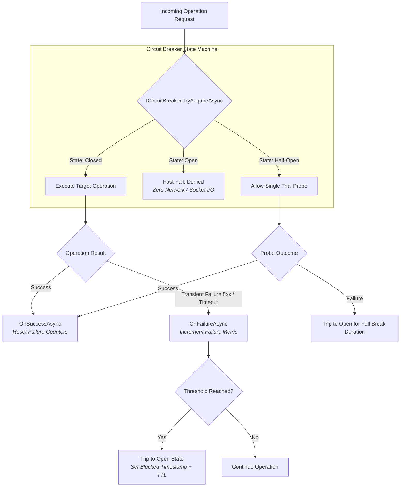

# Wiaoj.Resilience

[](https://dotnet.microsoft.com/) [](LICENSE)

An ultra-high-throughput, distributed resilience and fault-tolerance engine built for modern **.NET 10** cloud architectures.

Engineered with state-machine-backed circuit breakers, concurrency bulkheads, speculative hedging, timeout cancellation, and adaptive traffic shaping powered by `Wiaoj.DistributedCounter` for transparent in-memory and Redis cluster synchronization.

---

## 📑 Table of Contents

- [Architectural Overview](#-architectural-overview)
- [Key Features & Guarantees](#-key-features--guarantees)
- [Core Resilience Strategies](#-core-resilience-strategies)
  - [1. Circuit Breaker (Consecutive Failures & Sampling Window)](#1-circuit-breaker)
  - [2. Bulkhead (Concurrency Limiter & Resource Isolation)](#2-bulkhead-concurrency-limiter)
  - [3. Timeout & Cancellation Deadlines](#3-timeout--cancellation-deadlines)
  - [4. Hedging (Speculative Parallel Execution)](#4-hedging-speculative-parallel-execution)
  - [5. Fallback & Graceful Degradation](#5-fallback--graceful-degradation)
  - [6. Adaptive Concurrency (Latency-Driven Shaping)](#6-adaptive-concurrency)
- [Dual Invocation Models](#-dual-invocation-models)
  - [1. Zero-Allocation Result Pattern (`TryAcquireAsync`)](#1-zero-allocation-result-pattern)
  - [2. Idiomatic Delegate Wrapper (`ExecuteAsync`)](#2-idiomatic-delegate-wrapper)
- [State Inspection Without Acquiring (`GetStateAsync`)](#-state-inspection-without-acquiring)
- [Distributed Storage Integration (`Wiaoj.DistributedCounter`)](#-distributed-storage-integration)
- [Quick Start](#-quick-start)
- [Observability & OpenTelemetry](#-observability--opentelemetry)
- [Ecosystem Packages](#-ecosystem-packages)
- [License](#-license)

---

## 🏛 Architectural Overview



---

## ⚡ Key Features & Guarantees

- **Single Engine, Dual Storage:** Built on top of `IDistributedCounterFactory`, running with zero dependencies in-memory (`InMemoryCounterStorage`) or seamlessly synchronized across Kubernetes pods via Redis (`RedisCounterStorage`).
- **Zero-Allocation Result Pattern:** `TryAcquireAsync` returns immutable `CircuitExecutionDecision` structs, eliminating expensive exception stack traces on hot execution paths and high-throughput pipelines.
- **Thundering Herd Protection:** Strict concurrency gating in `Half-Open` state permits exactly **one** trial probe request through to recovering targets while fast-failing concurrent traffic.
- **Error Classification Awareness:** Ignores permanent client errors (`4xx Bad Request`, `404 Not Found`), tripping only on true transient failures (`5xx Server Error`, socket drops, timeouts).
- **Comprehensive OpenTelemetry Instrumentation:** Out-of-the-box activity tracing, metrics counters, and duration histograms for Prometheus and Grafana.

---

## 🛡️ Core Resilience Strategies

| Strategy | Primary Purpose | Best For | Status |
|---|---|---|---|
| **`Circuit Breaker`** | Shields failing targets from cascading failure loops by fast-failing traffic. | Webhooks, downstream REST APIs, remote microservices. | Production |
| **`Bulkhead`** | Limits maximum concurrent in-flight executions per resource to prevent thread starvation. | Multi-tenant worker pools, shared connection pools. | Planned |
| **`Timeout`** | Enforces maximum allowable execution deadlines via `CancellationToken`. | Long-hanging socket calls, slow database queries. | Planned |
| **`Hedging`** | Dispatches speculative parallel backup requests when latency exceeds p95 thresholds. | Read-only idempotent replica queries. | Planned |
| **`Fallback`** | Provides graceful degradation by returning defaults or secondary action paths. | Cached responses, dead-letter recording. | Planned |
| **`Adaptive Concurrency`** | Dynamically throttles concurrency limits based on observed p99 round-trip latency. | Congestion-sensitive downstream servers. | Planned |

---

### 1. Circuit Breaker

Supports two distinct algorithmic strategies depending on workload characteristics:

#### A. Consecutive Failures Strategy
Trips to `Open` state after $N$ consecutive transient failures occur without an intervening success. Ideal for webhooks and background workers:

```csharp
var options = new CircuitBreakerOptions
{
    FailureThreshold = 5,
    BreakDuration = TimeSpan.FromMinutes(2)
};

var breaker = new ConsecutiveFailuresCircuitBreaker(counterFactory, options, timeProvider, logger);
```

#### B. Sampling Window (Failure Rate %) Strategy
Trips to `Open` when the failure rate exceeds a percentage threshold within a rolling lookback window, requiring a minimum request throughput. Ideal for high-throughput APIs:

```csharp
var options = new SamplingWindowCircuitBreakerOptions
{
    FailureRateThreshold = 0.5,        // 50% failure rate
    MinimumThroughput = 20,            // Minimum 20 requests in window
    SamplingWindow = TimeSpan.FromSeconds(30),
    BreakDuration = TimeSpan.FromMinutes(1)
};

var breaker = new SamplingWindowCircuitBreaker(counterFactory, options, timeProvider, logger);
```

---

## 🎮 Dual Invocation Models

### 1. Zero-Allocation Result Pattern
Designed for high-throughput pipelines, middleware, and performance-critical loops without exception overhead:

```csharp
CircuitExecutionDecision decision = await breaker.TryAcquireAsync("orders-api", cancellationToken);

if (!decision.IsAllowed)
{
    // Fast-fail path: Circuit is OPEN
    TimeSpan retryAfter = decision.RetryAfter ?? TimeSpan.FromMinutes(1);
    return Results.StatusCode(503);
}

try
{
    await ExecuteHttpRequestAsync();
    await breaker.OnSuccessAsync("orders-api", cancellationToken);
}
catch (Exception ex) when (IsTransient(ex))
{
    await breaker.OnFailureAsync("orders-api", cancellationToken);
    throw;
}
```

### 2. Idiomatic Delegate Wrapper
Executes an asynchronous operation delegate, automatically recording success or failure and throwing `CircuitBreakerOpenException` if open:

```csharp
string response = await breaker.ExecuteAsync("payment-service", async ct =>
{
    return await httpClient.GetStringAsync("https://api.payments.com/v1/status", ct);
}, cancellationToken);
```

---

## 🔍 State Inspection Without Acquiring

Neither invocation model above is a way to *look* at a circuit. In the `Half-Open` state `TryAcquireAsync` hands out the trial probe that decides whether the target has recovered — a caller that only wanted to check has consumed the one attempt that was going to answer the question, and will report the target as usable without ever calling it.

`GetStateAsync` performs a read with **no state transition and no probe consumption**, which is what pre-emptive routing needs:

```csharp
// Provider routing: prefer a gateway whose circuit is closed,
// without burning the probe that belongs to a real attempt.
foreach (GatewayDescriptor candidate in candidates)
{
    CircuitState state = await breaker.GetStateAsync(candidate.Key, cancellationToken);

    if (state is CircuitState.Closed)
    {
        return candidate;
    }

    // HalfOpen reads as "recovering, prefer someone else" —
    // the probe is still available to whoever actually dispatches.
}
```

> **The result is advisory and may be stale.** Circuit state lives in a distributed counter and can change between this read and a subsequent acquire. A `Closed` result is *not* a guarantee that the next `TryAcquireAsync` will be permitted, so callers must still handle a denial at acquire time.

`CompositeCircuitBreaker` reports the most restrictive tier state — `Open` if any tier is open (short-circuiting the remaining tiers), otherwise `HalfOpen` if any tier is recovering — and acquires from no tier.

---

## 🗄️ Distributed Storage Integration

`Wiaoj.Resilience` delegates counter state, time-to-live (TTL), and distributed locking to `Wiaoj.DistributedCounter`.

```csharp
// 1. Single-Node In-Memory Mode (Zero Network Overhead)
builder.Services.AddDistributedCounter(c => c.UseInMemory());

// 2. Multi-Node Cluster Mode (Shared Circuit State across Kubernetes Pods)
builder.Services.AddDistributedCounter(c => c.UseRedis("redis-cluster:6379"));
```

---

## 🚀 Quick Start

### 1. Register Resilience Services

```csharp
using Microsoft.Extensions.DependencyInjection;
using Wiaoj.DistributedCounter;
using Wiaoj.Resilience;

var builder = WebApplication.CreateBuilder(args);

// Register Distributed Counter backing
builder.Services.AddDistributedCounter(c => c.UseInMemory());

// Register Circuit Breaker
builder.Services.AddSingleton<ICircuitBreaker>(sp =>
{
    var factory = sp.GetRequiredService<IDistributedCounterFactory>();
    var timeProvider = sp.GetRequiredService<TimeProvider>();
    return new ConsecutiveFailuresCircuitBreaker(factory, new CircuitBreakerOptions
    {
        FailureThreshold = 5,
        BreakDuration = TimeSpan.FromMinutes(1)
    }, timeProvider);
});
```

---

## 📊 Observability & OpenTelemetry

**Meter:** `Wiaoj.Resilience`

| Instrument | Kind | Tags | Description |
|---|---|---|---|
| `circuitbreaker.decisions` | Counter | `strategy`, `circuit`, `state`, `decision` | Acquire decisions, split by allowed/denied. |
| `circuitbreaker.trips` | Counter | `strategy`, `circuit`, `reason` | Transitions into the `Open` state. |
| `circuitbreaker.successes` | Counter | `strategy`, `circuit`, `recovered` | Recorded successes, flagging recoveries. |
| `circuitbreaker.failures` | Counter | `strategy`, `circuit` | Recorded failures. |
| `circuitbreaker.state` | ObservableGauge | `circuit` | Current state (0 = Closed, 1 = Open, 2 = HalfOpen). |

**ActivitySource:** `Wiaoj.Resilience`

| Span | Emitted by | Tags |
|---|---|---|
| `circuit_breaker.execute` | `ExecuteAsync` / `ExecuteWithFallbackAsync` | `resilience.key`, `resilience.circuit_state`, `resilience.outcome`, `resilience.probe` (half-open only), `resilience.retry_after_ms` (denied only) |
| `timeout.execute` | `ITimeoutStrategy.ExecuteAsync` | `resilience.key`, `resilience.timeout_ms`, `resilience.outcome` |

`resilience.outcome` is one of `success`, `failure`, `denied`, `timeout` or `cancelled`. Spans are set to `Error` status when the circuit denies execution, the operation throws (the exception is recorded on the span), or the deadline expires. Caller cancellation is tagged `cancelled` and left unset — it is not a fault of the protected target.

Spans cover the delegate-wrapper model. The zero-allocation `TryAcquireAsync` path emits metrics but no span: an acquire is a point-in-time decision rather than a unit of work with a duration, and instrumenting it would add an activity to the hot path it exists to keep clean. `StartActivity` returns `null` when nothing is subscribed, so the instrumentation costs nothing until a listener is attached.

```csharp
builder.Services.AddOpenTelemetry()
    .WithMetrics(metrics => metrics.AddMeter("Wiaoj.Resilience"))
    .WithTracing(tracing => tracing.AddSource("Wiaoj.Resilience"));
```

---

## 📦 Ecosystem Packages

| Package | Description | Reference Link |
|---|---|---|
| **`Wiaoj.DistributedCounter`** | High-performance atomic CAS counter and Redis Lua engine backing resilience state. | [README](../DistributedCounter/Wiaoj.DistributedCounter/README.md) |
| **`Wiaoj.RateLimiting`** | Comprehensive rate limiting algorithm suite (GCRA, Token Bucket, Sliding Window). | [README](../RateLimiting/Wiaoj.RateLimiting/README.md) |
| **`Wiaoj.Webhooks`** | Enterprise webhook delivery engine with sharded FIFO concurrency and SSRF defense. | [README](../Webhooks/Wiaoj.Webhooks/README.md) |
| **`Wiaoj.Webhooks.Resilience`** | Satellite adapter connecting `Wiaoj.Resilience` to the outbound webhook pipeline. | [README](../Webhooks/Wiaoj.Webhooks.Resilience/README.md) |

---

## 📄 License

This project is licensed under the [MIT License](../../LICENSE).