# Wiaoj.Webhooks

[](https://dotnet.microsoft.com/) 
[](LICENSE)

A modular, extensible, and distributed Webhook delivery and receiving engine built for **.NET 10** architectures.

Designed for high-throughput enterprise systems requiring strict partition FIFO ordering, resilient retry orchestration, distributed circuit breaking, inbound payload unwrapping, content-based fan-out filtering, SSRF security hardening, and native OpenTelemetry observability.

---

## Table of Contents

- [Architectural Overview](#-architectural-overview)
- [Ecosystem Packages](#-ecosystem-packages)
- [Key Capabilities & Design Highlights](#-key-capabilities--design-highlights)
- [Quick Start](#-quick-start)
  - [1. Register Core Engine & Policies](#1-register-core-engine--policies)
  - [2. Outbound Dispatching (Single & Batch)](#2-outbound-dispatching-single--batch)
  - [3. Inbound Ingress Hub (Routing & Subtree Unwrapping)](#3-inbound-ingress-hub-routing--subtree-unwrapping)
  - [4. 1-to-N Publishing & Content-Based Filtering](#4-1-to-n-publishing--content-based-filtering)
  - [5. Testing Application Services](#5-testing-application-services)
- [Core Modules Breakdown](#-core-modules-breakdown)
  - [1. Inbound JSON Envelope Unwrapping (PayloadPath)](#1-inbound-json-envelope-unwrapping-payloadpath)
  - [2. Outbound Endpoint Circuit Breakers](#2-outbound-endpoint-circuit-breakers)
  - [3. Atomic Batch Dispatching](#3-atomic-batch-dispatching)
  - [4. Content-Based Publishing Filter Expressions](#4-content-based-publishing-filter-expressions)
  - [5. Partitioning & Strict FIFO Concurrency](#5-partitioning--strict-fifo-concurrency)
  - [6. Self-Healing Stale Job Recovery](#6-self-healing-stale-job-recovery)
  - [7. Outbound SSRF Hardening & Egress Proxy](#7-outbound-ssrf-hardening--egress-proxy)
- [Observability & OpenTelemetry](#-observability--opentelemetry)
- [License](#-license)

---

## Architectural Overview

```mermaid
flowchart TD
    subgraph Inbound["(1) Inbound Ingress - Wiaoj.Webhooks.AspNetCore"]
        Req["Incoming Webhook HTTP POST"] --> Filter["WebhookHubEndpointFilter"]
        Filter -->|DoS Bounded Stream 64KB| Body["AsyncValueBuffer"]
        Body -->|Constant-Time HMAC & Replay Check| Auth["IWebhookSecretResolver"]
        Auth -->|Header / JSON Discriminator| Extractor["IWebhookEventDiscriminatorExtractor"]
        Extractor -->|XxHash128 Dedup| Dedup["IIdempotencyStore"]
        Dedup -->|Subtree Unwrapping Path| Unwrapper["Utf8JsonPayloadNavigator<br/><i>data.object -> Subtree</i>"]
        Unwrapper -->|Match .On / .MapHandler| Handler["Minimal API / Class Handler"]
        Handler --> Res["200 OK Response"]
    end
```

```mermaid
flowchart TD 
    subgraph Outbound["(2) Outbound Egress - Wiaoj.Webhooks & Transports"]
        App["Application Dispatch<br/><i>DispatchAsync / DispatchBatchAsync</i>"] --> Disp["IWebhookDispatcher"]
        Disp -->|Save / SaveBatch| Store[("IWebhookStore - State at Rest")]
        Disp -->|Push with PartitionKey / EnqueueBatch| Transport[("Sharded / Channel Transport")]
        Transport --> Worker["Background Consumer Loop"]
        Worker --> Runner["WebhookPipelineRunner"]
        Runner --> M1["PartitionedDeliveryMiddleware<br/><i>Strict FIFO Lock</i>"]
        M1 --> M2["Idempotency & BloomFilter<br/><i>Deduplication</i>"]
        M2 --> M3["RateLimitingMiddleware<br/><i>Quota Throttling</i>"]
        M3 --> M4["CircuitBreakerMiddleware<br/><i>Shields Failing Targets</i>"]
        M4 --> M5["Standard Headers & Content-Digest<br/><i>RFC 9530 Metadata</i>"]
        M5 --> M6["SigningMiddleware<br/><i>HMAC / Asymmetric Signers</i>"]
        M6 --> M7["HttpWebhookDeliverer<br/><i>SSRF-Protected Sockets POST</i>"]
        M7 --> M8["RetryMiddleware<br/><i>Exponential Backoff</i>"]
        M7 --> Target["Destination Webhook URL"]
    end
```





---

## Ecosystem Packages

| Package | Description | Reference Link |
|---|---|---|
| **`Wiaoj.Webhooks.Abstractions`** | Core contracts, value objects (`WebhookPartitionKey`, `WebhookEndpointId`, `WebhookJobId`), and polymorphic delivery outcomes. | [README](./Wiaoj.Webhooks.Abstractions/README.md) |
| **`Wiaoj.Webhooks`** | Core delivery engine, pipeline runner, HTTP deliverer, HMAC signers, SSRF filter, and retry policies. | [README](./Wiaoj.Webhooks/README.md) |
| **`Wiaoj.Webhooks.AspNetCore`** | Inbound webhook receiver engine, DoS stream protection, policy routing, payload subtree unwrapping, and Minimal API Hubs. | [README](./Wiaoj.Webhooks.AspNetCore/README.md) |
| **`Wiaoj.Webhooks.Publishing`** | 1-to-N Webhook Gateway and subscriber fan-out broker with wildcard topic matching and content-based filter expressions. | [README](./Wiaoj.Webhooks.Publishing/README.md) |
| **`Wiaoj.Webhooks.Testing`** | Official test doubles (`FakeWebhookDispatcher`, `FakeWebhookTransport`, `FakeWebhookDeliverer`), test context harness, and fluent assertion API. | [README](./Wiaoj.Webhooks.Testing/README.md) |
| **`Wiaoj.Resilience`** | Standalone distributed circuit breaker engine and resilience strategies powered by `Wiaoj.DistributedCounter`. | [README](../Resilience/Wiaoj.Resilience/README.md) |
| **`Wiaoj.Webhooks.Transports.InMemory`** | High-performance in-memory channel transport and `ShardedWebhookTransport` partition router. | [README](./Wiaoj.Webhooks.Transports.InMemory/README.md) |
| **`Wiaoj.Webhooks.BloomFilter`** | Duplicate webhook suppression plugin backed by `Wiaoj.BloomFilter`. | [README](./Wiaoj.Webhooks.BloomFilter/README.md) |
| **`Wiaoj.Webhooks.RateLimiting`** | Distributed per-endpoint rate limiting middleware backed by `Wiaoj.RateLimiting`. | [README](./Wiaoj.Webhooks.RateLimiting/README.md) |
| **`Wiaoj.Webhooks.Signing.Asymmetric`** | Asymmetric cryptographic signers supporting RSA (PS256/RS256), ECDSA (ES256/ES384/ES512), and Ed25519. | [README](./Wiaoj.Webhooks.Signing.Asymmetric/README.md) |

---

## Key Capabilities & Design Highlights

- **Span-Based Value Objects:** Core identifiers (`WebhookPartitionKey`, `WebhookEndpointId`, `WebhookJobId`, `IdempotencyKey`, `WebhookSignature`) implement `ISpanParsable<T>`, `IUtf8SpanParsable<T>`, `ISpanFormattable`, and `IAlternateEqualityComparer<ReadOnlySpan<char>, T>` for efficient dictionary lookups.
- **Inbound Multi-Event Ingress Hub:** Map single-URL ingress routes (`app.MapWebhook("/path")`) supporting `.On<T>()`, `.MapHandler<T>()`, `.OnPing()`, `.WithPayloadPath("data.object")`, and `.IgnoreUnhandledEvents()`.
- **Endpoint Circuit Breaking:** Integrates state-machine circuit breakers (`Closed`, `Open`, `HalfOpen`) via `Wiaoj.Resilience` to fast-fail calls to failing targets, avoiding wasted socket connections and thread pool starvation.
- **Atomic Bulk Dispatching:** `dispatcher.DispatchBatchAsync(...)` records and enqueues bulk domain events in a single database batch and transport operation.
- **Content-Based 1-to-N Filtering:** Evaluates subscriber rule expressions (e.g. `Amount >= 100 && Currency == 'USD'`) using tokenized AST caches.
- **End-to-End Partitioning:** Enforces **strict FIFO message sequence** per partition key via sharded channel routing (`XxHash3`) and dynamic endpoint mailbox locks.
- **Unmanaged Secrets & Cryptographic HMAC:** Secrets are held in GC-immune native memory (`Secret<byte>`) or at-rest encrypted envelopes (`EncryptedSecret<T>`).
- **Self-Healing Recovery:** Background service (`StaleJobRecoveryService`) periodically sweeps and recovers abandoned in-flight leases and stranded queued jobs caused by node crashes.

---

## Quick Start

### 1. Register Core Engine & Policies

```csharp
using Microsoft.Extensions.DependencyInjection;
using Wiaoj.Webhooks;
using Wiaoj.Webhooks.Retries;

var builder = WebApplication.CreateBuilder(args);

builder.Services.AddWiaojWebhooks(webhooks =>
{
    // ── Outbound Sending Engine ──
    webhooks.UseShardedInMemoryTransport(shardCount: 8)
            .UsePartitionedDelivery()
            .UseIdempotency(TimeSpan.FromHours(24))
            .UseCircuitBreaker(options =>
            {
                options.FailureThreshold = 5;
                options.BreakDuration = TimeSpan.FromMinutes(1);
            })
            .UseStandardHeaders()
            .UseContentDigest(ContentDigestAlgorithm.XxHash128)
            .UseHmacSha256Signing()
            .UseSnakeCaseJson()
            .UseExponentialBackoffRetry();

    // ── Inbound Receiving Policies ──
    webhooks.AddInbound(inbound =>
    {
        inbound.AddPolicy("GitHub", policy => policy
            .WithSigner<GitHubWebhookSigner>()
            .WithEventFromHeader("X-GitHub-Event")
            .WithTolerance(TimeSpan.FromMinutes(5))
            .UseSecret(Secret.From("ghsec_production_secret_key")));

        inbound.AddPolicy("Stripe", policy => policy
            .UseHmacSha256(headerName: "Stripe-Signature")
            .WithEventFromJsonProperty("type")
            .WithPayloadPath("data.object")
            .UseSecret(Secret.From("whsec_production_stripe_key")));
    });

    // ── 1-to-N Publishing Gateway ──
    webhooks.AddPublishing();
});

var app = builder.Build();
```

### 2. Outbound Dispatching (Single & Batch)

```csharp
[WebhookEvent("order.created")]
public sealed record OrderCreatedEvent(string OrderId, decimal Amount) : IWebhookEvent;

public class OrderService(IWebhookDispatcher dispatcher)
{
    public async Task CreateOrderAsync(string orderId, decimal amount, CancellationToken ct)
    {
        var @event = new OrderCreatedEvent(orderId, amount);

        // Single dispatch with partition key for strict FIFO sequencing
        await dispatcher.DispatchAsync(
            endpointId: new WebhookEndpointId("customer-endpoint-1"),
            payload: @event,
            partitionKey: orderId,
            cancellationToken: ct);
    }

    public async Task ProcessBulkOrdersAsync(List<OrderCreatedEvent> orders, CancellationToken ct)
    {
        // Atomic bulk dispatch in a single database save and transport enqueue
        IReadOnlyList<WebhookDeliveryHandle> handles = await dispatcher.DispatchBatchAsync(
            endpointId: new WebhookEndpointId("billing-service"),
            payloads: orders,
            partitionKeySelector: e => e.OrderId,
            cancellationToken: ct);
    }
}
```

### 3. Inbound Ingress Hub (Routing & Subtree Unwrapping)

```csharp
app.MapWebhook("/api/webhooks/stripe")
   .UsePolicy("Stripe")
   .WithPayloadPath("data.object") // Automatically unwraps nested JSON subtree into DTO
   .OnPing()
   .On<StripePaymentIntentDto>("payment_intent.succeeded", async (StripePaymentIntentDto payment, AppDbContext db, CancellationToken ct) =>
   {
       await db.Payments.AddAsync(new PaymentRecord(payment.Id, payment.Amount), ct);
       await db.SaveChangesAsync(ct);
   })
   .IgnoreUnhandledEvents();
```

### 4. 1-to-N Publishing & Content-Based Filtering

```csharp
public class InvoiceService(IWebhookPublisher publisher, IWebhookSubscriptionStore store)
{
    public async Task RegisterSubscriberAsync(WebhookEndpointId endpointId, CancellationToken ct)
    {
        // Register subscription with content-based filter expression
        var subscription = new WebhookSubscription(endpointId, "invoice.*")
        {
            FilterExpression = "Amount >= 1000 && Currency == 'USD'"
        };

        await store.SaveSubscriptionAsync(subscription, ct);
    }

    public async Task PublishInvoiceAsync(InvoiceCreatedEvent invoice, CancellationToken ct)
    {
        // Fans out event strictly to matching subscribers across namespaces
        IReadOnlyList<WebhookDeliveryHandle> handles = await publisher.PublishAsync(invoice, ct);
    }
}
```

### 5. Testing Application Services

```csharp
public sealed class OrderServiceTests
{
    [Fact]
    public async Task CompleteOrder_DispatchesWebhookEvent()
    {
        var testContext = new WebhookTestContext();
        var orderService = new OrderService(testContext.Dispatcher, new FakeOrderRepository());

        await orderService.CreateOrderAsync("ORD-100", 250m, CancellationToken.None);

        testContext.Dispatcher.ShouldHaveDispatched<OrderCreatedEvent>(new WebhookEndpointId("customer-endpoint-1"));
        testContext.Dispatcher.ShouldHaveDispatchCount(1);
    }
}
```

---

## Core Modules Breakdown

### 1. Inbound JSON Envelope Unwrapping (PayloadPath)
Extracts nested subtrees without intermediate heap allocations:

```csharp
// Unwraps {"id":"evt_1","data":{"object":{"id":"pi_123"}}} directly into PaymentDto
policy.WithPayloadPath("data.object");
```

### 2. Outbound Endpoint Circuit Breakers
Shields destination endpoints and worker threads using atomic state machines:

```csharp
webhooks.UseCircuitBreaker(options =>
{
    options.FailureThreshold = 5;
    options.BreakDuration = TimeSpan.FromMinutes(2);
});
```

### 3. Atomic Batch Dispatching
Executes bulk event dispatches in a single database operation and sharded transport write:

```csharp
await dispatcher.DispatchBatchAsync(endpointId, events, partitionKeySelector: e => e.OrderId, ct);
```

### 4. Content-Based Publishing Filter Expressions
Subscribers filter events based on domain payload properties:

```csharp
subscription.FilterExpression = "Amount >= 500 && Status == 'Completed'";
```

### 5. Partitioning & Strict FIFO Concurrency
Guarantees sequential FIFO delivery per partition key while executing distinct partitions in parallel:

```csharp
webhooks.UsePartitionedDelivery();
webhooks.UseShardedInMemoryTransport(shardCount: Environment.ProcessorCount * 2);
```

### 6. Self-Healing Stale Job Recovery
Sweeps both expired in-flight leases and stranded queued jobs caused by node crashes:

```csharp
webhooks.UseStaleJobRecovery(options =>
{
    options.PollingInterval = TimeSpan.FromSeconds(30);
    options.QueuedJobStaleThreshold = TimeSpan.FromMinutes(2);
    options.RecoveryLeaseDuration = TimeSpan.FromMinutes(2);
});
```

### 7. Outbound SSRF Hardening & Egress Proxy
Inspects resolved IP addresses at the TCP socket layer to block private ranges and cloud metadata:

```csharp
webhooks.ConfigureSecurity(options =>
{
    options.AllowPrivateNetworks = false;
    options.ConnectTimeout = TimeSpan.FromSeconds(5);
    options.Proxy = new WebProxy("http://egress-proxy:8080");
});
```

---

## Observability & OpenTelemetry

- **ActivitySource:** `Wiaoj.Webhooks`, `Wiaoj.Resilience`
  - Spans: `webhook.dispatch`, `webhook.dispatch.batch`, `webhook.deliver`, `webhook.http.post`, `circuit_breaker.execute`
  - Tags: `webhook.endpoint_id`, `webhook.partition_key`, `webhook.status_code`, `webhook.batch_id`, `webhook.batch_size`, `webhook.success`
- **Meter Instruments:** `Wiaoj.Webhooks`
  - `wiaoj.webhooks.dispatch.count` (Counter)
  - `wiaoj.webhooks.dispatch.batch.count` (Counter)
  - `wiaoj.webhooks.dispatch.batch.size` (Histogram)
  - `wiaoj.webhooks.delivery.attempt.count` (Counter)
  - `wiaoj.webhooks.delivery.success.count` (Counter)
  - `wiaoj.webhooks.delivery.failure.count` (Counter)
  - `wiaoj.webhooks.delivery.duration` (Histogram in ms)
  - `wiaoj.webhooks.retry.count` (Counter)
  - `wiaoj.webhooks.dead_letter.count` (Counter)

---

## 📄 License

This project is licensed under the [MIT License](./LICENSE).