# Wiaoj.Webhooks

[](https://dotnet.microsoft.com/)
[](https://github.com/wiaoj/libraries)
[](LICENSE)

An ultra-high-throughput, modular, resilient, and enterprise-grade Webhook delivery and receiving engine built from the ground up for modern **.NET 10** architectures.

Engineered with zero-allocation span parsers, constant-time cryptographic verification, unmanaged memory secret protection (`Secret<byte>`), deterministic partition sharding (`XxHash3`), Bloom filter deduplication, SSRF defense, distributed rate limiting, and OpenTelemetry observability.

---

## 📑 Table of Contents

- [Architectural Overview](#-architectural-overview)
- [Ecosystem Packages](#-ecosystem-packages)
- [Key Features & Guarantees](#-key-features--guarantees)
- [Quick Start](#-quick-start)
  - [1. Register Core Engine (Outbound & Inbound)](#1-register-core-engine-outbound--inbound)
  - [2. Dispatch Outbound Event](#2-dispatch-outbound-event)
  - [3. Receive Inbound Event via Minimal API](#3-receive-inbound-event-via-minimal-api)
- [Core Architecture & Modules](#-core-architecture--modules)
  - [1. End-to-End Partitioning & Sharded Concurrency](#1-end-to-end-partitioning--sharded-concurrency)
  - [2. Inbound Receiving Engine (ASP.NET Core Minimal API)](#2-inbound-receiving-engine-aspnet-core-minimal-api)
  - [3. Unmanaged Secrets & Cryptographic HMAC](#3-unmanaged-secrets--cryptographic-hmac)
  - [4. Bloom Filter O(1) Deduplication](#4-bloom-filter-o1-deduplication)
  - [5. Outbound SSRF Hardening & Egress Proxy](#5-outbound-ssrf-hardening--egress-proxy)
  - [6. Resilient Retries & Self-Healing Recovery](#6-resilient-retries--self-healing-recovery)
  - [7. Distributed Rate Limiting](#7-distributed-rate-limiting)
- [Observability & OpenTelemetry](#-observability--opentelemetry)
- [Verification & Test Suite](#-verification--test-suite)
- [License](#-license)

---

## 🏛 Architectural Overview

```mermaid
flowchart TD
    subgraph Inbound["(1) Inbound Ingress - Wiaoj.Webhooks.AspNetCore"]
        Req["Webhook HTTP POST"] --> Filter["WebhookReceiverEndpointFilter"]
        Filter -->|DoS Bounded Stream 64KB| Body["AsyncValueBuffer"]
        Body -->|Constant-Time HMAC & Replay| Auth["IWebhookSecretResolver"]
        Auth -->|XxHash128 Dedup| Dedup["IIdempotencyStore"]
        Dedup -->|ReadOnlySequence Deser| Handler["Minimal API / Class Handler"]
        Handler --> Res["200 OK Response"]
    end

    subgraph Outbound["(2) Outbound Egress - Wiaoj.Webhooks & Transports"]
        App["Application Dispatch"] -->|DispatchAsync| Disp["IWebhookDispatcher"]
        Disp -->|Store-First| Store[("IWebhookStore - State at Rest")]
        Disp -->|Push with PartitionKey| Transport[("Sharded / Queue Transport")]
        Transport --> Worker["Background Consumer Loop"]
        Worker --> Runner["WebhookPipelineRunner"]
        Runner --> M1["PartitionedDeliveryMiddleware<br/><i>Strict FIFO Lock</i>"]
        M1 --> M2["Idempotency & BloomFilter<br/><i>O(1) Deduplication</i>"]
        M2 --> M3["Standard Headers & Content-Digest<br/><i>RFC 9530 xxh128 / sha-256</i>"]
        M3 --> M4["SigningMiddleware<br/><i>HMAC-SHA256 / SHA512</i>"]
        M4 --> M5["HttpWebhookDeliverer<br/><i>SSRF-Protected Sockets POST</i>"]
        M5 --> M6["RetryMiddleware<br/><i>Exponential Backoff + Jitter</i>"]
        M5 --> Target["Destination Webhook URL"]
    end
```



---

## 📦 Ecosystem Packages

| Package | Description | Reference Link |
|---|---|---|
| **`Wiaoj.Webhooks.Abstractions`** | Pure contracts, value objects (`WebhookPartitionKey`, `WebhookEndpointId`, `IdempotencyKey`, `WebhookSignature`), and context definitions with zero 3rd-party dependencies. | [README](./Wiaoj.Webhooks.Abstractions/README.md) |
| **`Wiaoj.Webhooks`** | Core engine, middleware pipeline runner, HTTP delivery, HMAC signers, SSRF filter, backoff policies, and OpenTelemetry instrumentation. | [README](./Wiaoj.Webhooks/README.md) |
| **`Wiaoj.Webhooks.AspNetCore`** | Inbound webhook receiver engine, DoS stream protection, policy routing, unmanaged secret verification, and Minimal API integration. | [README](./Wiaoj.Webhooks.AspNetCore/README.md) |
| **`Wiaoj.Webhooks.Transports.InMemory`** | High-performance in-memory channel transport, `ShardedWebhookTransport` partition router, and background worker pool. | [README](./Wiaoj.Webhooks.Transports.InMemory/README.md) |
| **`Wiaoj.Webhooks.BloomFilter`** | O(1) duplicate webhook suppression plugin backed by `Wiaoj.BloomFilter` without database roundtrips. | [README](./Wiaoj.Webhooks.BloomFilter/README.md) |
| **`Wiaoj.Webhooks.DistributedCounter`** | Distributed per-endpoint rate limiting plugin backed by `Wiaoj.DistributedCounter` with automatic delayed re-queuing. | [README](./Wiaoj.Webhooks.DistributedCounter/README.md) |

---

## ⚡ Key Features & Guarantees

- **Zero-Allocation Primitives:** Core value objects (`WebhookPartitionKey`, `WebhookEndpointId`, `WebhookJobId`, `IdempotencyKey`, `WebhookSignature`) strictly implement `ISpanParsable<T>`, `IUtf8SpanParsable<T>`, `ISpanFormattable`, `IUtf8SpanFormattable`, and `IAlternateEqualityComparer<ReadOnlySpan<char>, T>` for allocation-free lookups.
- **End-to-End Deterministic Partitioning:** Outbox, transport queues, and execution middleware share a unified `WebhookPartitionKey`, guaranteeing **strict FIFO message sequence** per partition while executing different partitions in massive parallel throughput.
- **Constant-Time Verification & Unmanaged Secrets:** Secrets are held in GC-immune unmanaged memory (`Secret<byte>`) or at-rest encrypted envelopes (`EncryptedSecret<T>`), completely preventing plain-text secret leakage to memory dumps or logs.
- **Dual Inbound Invocation Model:** Full support for Minimal API delegate injection (`DbContext`, `ILogger`, `CancellationToken`, `WebhookReceiverContext<T>`) and class-based handlers (`IWebhookReceiverHandler<TEvent>`).
- **DoS & SSRF Defense:** Bounded stream buffering (`AsyncValueBuffer<byte>`) prevents memory exhaustion, while socket-level IP validation (`WebhookIpFilter`) blocks cloud metadata, loopback, private ranges, and 6to4/NAT64/Teredo tunneling attacks.
- **Comprehensive Observability:** OpenTelemetry distributed tracing spans (`ActivitySource`) and runtime delivery metrics (`Meter`) capturing attempt latencies, status codes, and failure distributions.

---

## 🚀 Quick Start

### 1. Register Core Engine (Outbound & Inbound)

```csharp
using Microsoft.Extensions.DependencyInjection;
using Wiaoj.Webhooks;
using Wiaoj.Webhooks.Retries;

var builder = WebApplication.CreateBuilder(args);

// Register Complete Webhooks Engine in a Single Unified Builder Call
builder.Services.AddWiaojWebhooks(webhooks =>
{
    // ── 1. Outbound (Sending) Engine ──
    webhooks.UseShardedInMemoryTransport(shardCount: 8, capacityPerShard: 10_000)
            .UsePartitionedDelivery()
            .UseStandardHeaders()
            .UseContentDigest(ContentDigestAlgorithm.XxHash128)
            .UseIdempotency(TimeSpan.FromHours(24))
            .UseHmacSha256Signing()
            .UseExponentialBackoffRetry(new ExponentialBackoffOptions
            {
                MaxAttempts = 5,
                InitialDelay = TimeSpan.FromSeconds(2),
                Multiplier = 2.0,
                Jitter = Wiaoj.Extensions.Jitter.Medium
            });

    // ── 2. Inbound (Receiving) Policy Engine ──
    webhooks.AddInbound(inbound =>
    {
        inbound.AddPolicy("Stripe", policy => policy
            .UseHmacSha256("Stripe-Signature")
            .WithTolerance(TimeSpan.FromMinutes(3))
            .FromConfiguration(builder.Configuration.GetSection("Webhooks:Inbound:Stripe")));
    });
});

var app = builder.Build();
```

### 2. Dispatch Outbound Event

```csharp
// Define Event
[WebhookEvent("order.created")]
public sealed record OrderCreatedEvent(string OrderId, decimal Amount) : IWebhookEvent;

// Dispatch with Order-Level Partitioning for strict FIFO
public class OrderService(IWebhookDispatcher dispatcher)
{
    public async Task CreateOrderAsync(string orderId, decimal amount, CancellationToken ct)
    {
        var @event = new OrderCreatedEvent(orderId, amount);
        
        await dispatcher.DispatchAsync(
            endpointId: new WebhookEndpointId("customer-endpoint-1"),
            payload: @event,
            partitionKey: orderId, // Strict FIFO for this specific order
            cancellationToken: ct);
    }
}
```

### 3. Receive Inbound Event via Minimal API

```csharp
app.MapWebhook<OrderCreatedEvent>("/api/webhooks/orders", async (
    OrderCreatedEvent @event,
    WebhookReceiverContext<OrderCreatedEvent> context,
    AppDbContext db,
    CancellationToken ct) =>
{
    await db.Orders.AddAsync(new Order(@event.OrderId, @event.Amount), ct);
    await db.SaveChangesAsync(ct);
})
.UsePolicy("Stripe");

app.Run();
```

---

## ⚙️ Core Architecture & Modules

### 1. End-to-End Partitioning & Sharded Concurrency
Ensures events for the same partition key (`OrderId`, `CustomerId`, or `EndpointId`) execute sequentially in strict FIFO order, while distinct partition keys execute concurrently across CPU cores:

```csharp
// 1. Dynamic Zero-Collision Mailbox Lock (In-Process Synchronization)
webhooks.UsePartitionedDelivery();

// 2. Composed Transport Sharding (Lock-Free FIFO with XxHash3 SIMD routing)
webhooks.UseShardedInMemoryTransport(shardCount: Environment.ProcessorCount * 2);
```

### 2. Inbound Receiving Engine (ASP.NET Core Minimal API)
Provides high-performance, DoS-protected inbound webhook endpoints with automatic signature verification, idempotency deduplication, and RFC 9457 Problem Details error responses:

```csharp
// Declarative endpoint toggles
app.MapWebhook<DiagnosticEvent>("/webhooks/internal")
   .AllowUnsigned()                  // Disables signature requirement for internal networks
   .DisableIdempotency()             // Disables deduplication cache
   .WithMaxBodySize(1024 * 1024);    // Increases DoS stream limit to 1 MB
```

### 3. Unmanaged Secrets & Cryptographic HMAC
Supports constant-time HMAC-SHA256 and HMAC-SHA512 verification. Keys are stored in GC-immune unmanaged memory (`Secret<byte>`) or at-rest encrypted envelopes (`EncryptedSecret<T>`):

```csharp
using var secret = Secret.From("whsec_production_secret_key");
app.MapWebhook<OrderCreatedEvent>("/webhooks/orders")
   .WithSecret(secret);
```

### 4. Bloom Filter O(1) Deduplication
Intercepts identical events before HTTP transmission using probabilistic in-memory bit vectors, short-circuiting with `WebhookDeliveryResult.Duplicate` in sub-microsecond timeframes:

```csharp
builder.Services.AddBloomFilter(bf => bf.AddFilter("webhook-dedup", 1_000_000, 0.001));
builder.Services.AddSingleton<IBloomFilter>(sp => sp.GetRequiredKeyedService<IBloomFilter>("webhook-dedup"));

webhooks.UseBloomFilterDeduplication();
```

### 5. Outbound SSRF Hardening & Egress Proxy
Protects internal infrastructure from Server-Side Request Forgery by inspecting destination IP addresses at the TCP socket layer:

```csharp
webhooks.ConfigureSecurity(options =>
{
    options.AllowPrivateNetworks = false;            // Strict SSRF defense
    options.ConnectTimeout = TimeSpan.FromSeconds(5);
    options.Proxy = new WebProxy("http://egress-proxy:8080");
});
```

### 6. Resilient Retries & Self-Healing Recovery
Classifies HTTP status codes into transient (`5xx`, `429`, `408`, socket drops) vs permanent (`400`, `401`, `403`, `404`) failures with jittered backoff, while `StaleJobRecoveryService` recovers abandoned jobs from crashed workers:

```csharp
webhooks.UseExponentialBackoffRetry(new ExponentialBackoffOptions
{
    MaxAttempts = 5,
    InitialDelay = TimeSpan.FromSeconds(2),
    Multiplier = 2.0
});

webhooks.UseStaleJobRecovery(options =>
{
    options.PollingInterval = TimeSpan.FromSeconds(30);
    options.RecoveryLeaseDuration = TimeSpan.FromMinutes(2);
});
```

### 7. Distributed Rate Limiting
Enforces per-endpoint delivery rate limits across a multi-node cluster using sliding-window counters:

```csharp
webhooks.UseDistributedRateLimiting(maxRequestsPerWindow: 50, window: TimeSpan.FromSeconds(1));
```

---

## 📊 Observability & OpenTelemetry

The engine emits comprehensive distributed tracing and metrics:

- **ActivitySource:** `Wiaoj.Webhooks`
  - Spans: `webhook.dispatch`, `webhook.deliver`, `webhook.http.post`
  - Tags: `webhook.endpoint_id`, `webhook.partition_key`, `webhook.status_code`, `webhook.success`
- **Meter Instruments:** `Wiaoj.Webhooks`
  - `wiaoj.webhooks.dispatch.count` (Counter)
  - `wiaoj.webhooks.delivery.attempt.count` (Counter)
  - `wiaoj.webhooks.delivery.success.count` (Counter)
  - `wiaoj.webhooks.delivery.failure.count` (Counter)
  - `wiaoj.webhooks.delivery.duration` (Histogram in ms)
  - `wiaoj.webhooks.retry.count` (Counter)
  - `wiaoj.webhooks.dead_letter.count` (Counter)

---

## 🧪 Verification & Test Suite

All modules are strictly verified through comprehensive unit, security, and concurrency stress tests covering edge cases, DoS defenses, clock skews, and multi-threaded race conditions:

```bash
dotnet test tests/Wiaoj.Webhooks.Tests.Unit/Wiaoj.Webhooks.Tests.Unit.csproj
```

---

## 📄 License

This project is licensed under the [MIT License](../../LICENSE).