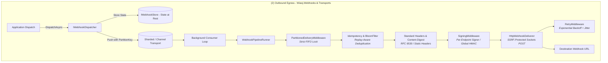

# Wiaoj.Webhooks

[](https://dotnet.microsoft.com/) 
[](LICENSE)

An ultra-high-throughput, modular, resilient, and enterprise-grade Webhook delivery and receiving engine built from the ground up for modern **.NET 10** architectures.

Engineered with zero-allocation span parsers, constant-time cryptographic verification, unmanaged memory secret protection (`Secret<byte>`), deterministic partition sharding (`XxHash3`), Bloom filter deduplication, SSRF defense, distributed rate limiting, and OpenTelemetry observability.

---

## 📑 Table of Contents

- [Architectural Overview](#-architectural-overview)
- [Ecosystem Packages](#-ecosystem-packages)
- [Performance & Benchmark Results](#-performance--benchmark-results)
- [Key Features & Guarantees](#-key-features--guarantees)
- [Quick Start](#-quick-start)
  - [1. Register Core Engine](#1-register-core-engine)
  - [2. Outbound Dispatching](#2-outbound-dispatching)
  - [3. Inbound Ingress Hub (Multi-Event Routing)](#3-inbound-ingress-hub-multi-event-routing)
  - [4. 1-to-N Publishing & Fan-Out](#4-1-to-n-publishing--fan-out)
- [Core Modules Breakdown](#-core-modules-breakdown)
  - [1. Inbound Ingress Hub & Discriminator Extraction](#1-inbound-ingress-hub--discriminator-extraction)
  - [2. Per-Endpoint Cryptographic Customization](#2-per-endpoint-cryptographic-customization)
  - [3. End-to-End Partitioning & Sharded Concurrency](#3-end-to-end-partitioning--sharded-concurrency)
  - [4. Self-Healing Stale & Zombie Job Recovery](#4-self-healing-stale--zombie-job-recovery)
  - [5. Outbound SSRF Hardening & Egress Proxy](#5-outbound-ssrf-hardening--egress-proxy)
- [Observability & OpenTelemetry](#-observability--opentelemetry)
- [License](#-license)

---

## 🏛 Architectural Overview

```mermaid
flowchart TD
    subgraph Inbound["(1) Inbound Ingress - Wiaoj.Webhooks.AspNetCore"]
        Req["Incoming Webhook HTTP POST"] --> Filter["WebhookHubEndpointFilter"]
        Filter -->|DoS Bounded Stream 64KB| Body["AsyncValueBuffer"]
        Body -->|Constant-Time HMAC & Replay| Auth["IWebhookSecretResolver"]
        Auth -->|Header / JSON Discriminator| Extractor["IWebhookEventDiscriminatorExtractor"]
        Extractor -->|XxHash128 Dedup| Dedup["IIdempotencyStore"]
        Dedup -->|Match .On / .MapHandler| Handler["Minimal API / Class Handler"]
        Handler --> Res["200 OK Response"]
    end
```




---

## 📦 Ecosystem Packages

| Package | Description | Reference Link |
|---|---|---|
| **`Wiaoj.Webhooks.Abstractions`** | Pure contracts, value objects (`WebhookPartitionKey`, `WebhookEndpointId`, `WebhookJobId`, `IdempotencyKey`, `WebhookSignature`), and context definitions with zero 3rd-party dependencies. | [README](./Wiaoj.Webhooks.Abstractions/README.md) |
| **`Wiaoj.Webhooks`** | Core outbound engine, pipeline runner, HTTP deliverer, HMAC signers, SSRF filter, backoff policies, recovery services, and OpenTelemetry instrumentation. | [README](./Wiaoj.Webhooks/README.md) |
| **`Wiaoj.Webhooks.AspNetCore`** | Inbound webhook receiver engine, DoS stream protection, policy routing, discriminator extractors, and Minimal API Multi-Event Hub integration. | [README](./Wiaoj.Webhooks.AspNetCore/README.md) |
| **`Wiaoj.Webhooks.Publishing`** | 1-to-N Webhook Gateway and subscriber fan-out broker with wildcard topic matching. | [README](./Wiaoj.Webhooks.Publishing/README.md) |
| **`Wiaoj.Webhooks.Signing.Asymmetric`** | Asymmetric cryptographic signers supporting RSA (PS256/RS256), ECDSA (ES256/ES384/ES512), and Ed25519. | [README](./Wiaoj.Webhooks.Signing.Asymmetric/README.md) |
| **`Wiaoj.Webhooks.Transports.InMemory`** | High-performance in-memory channel transport, `ShardedWebhookTransport` partition router, and background worker pool. | [README](./Wiaoj.Webhooks.Transports.InMemory/README.md) |
| **`Wiaoj.Webhooks.BloomFilter`** | O(1) duplicate webhook suppression plugin backed by `Wiaoj.BloomFilter` without database roundtrips. | [README](./Wiaoj.Webhooks.BloomFilter/README.md) |
| **`Wiaoj.Webhooks.RateLimiting`** | Distributed per-endpoint rate limiting middleware backed by `Wiaoj.RateLimiting` with automatic delayed re-queuing. | [README](./Wiaoj.Webhooks.RateLimiting/README.md) |

---

## 📊 Performance & Benchmark Results

Measured with **BenchmarkDotNet v0.15.8** on an **AMD Ryzen 5 7500F (.NET 10.0.9, x86-64-v4)** running 100% full dispatch lifecycle:

| Method | Mean | Allocated | Alloc Ratio | Gen0 |
|---|---|---|---|---|
| **Wiaoj.Webhooks** | **1.615 μs** | **816 B** | **1.00** | **0.0038** |
| **Wolverine** | 1.481 μs | 1,696 B | 2.08 | 0.1659 |
| **MassTransit** | 3.190 μs | 8,153 B | 9.99 | 0.0153 |

* **10x Lower Memory:** Wiaoj allocated only **816 Bytes** compared to MassTransit's **8,153 Bytes**.
* **43x Lower GC Pressure:** Wiaoj triggered Gen0 collections at a rate of **0.0038** compared to Wolverine's **0.1659**, ensuring flat and predictable P99 latency curves under sustained enterprise workloads.

---

## ⚡ Key Features & Guarantees

- **Zero-Allocation Primitives:** Core value objects (`WebhookPartitionKey`, `WebhookEndpointId`, `WebhookJobId`, `IdempotencyKey`, `WebhookSignature`) strictly implement `ISpanParsable<T>`, `IUtf8SpanParsable<T>`, `ISpanFormattable`, `IUtf8SpanFormattable`, and `IAlternateEqualityComparer<ReadOnlySpan<char>, T>`.
- **Inbound Multi-Event Ingress Hub:** Single-URL ingress routing (`app.MapWebhook("/path")`) supporting `.On<T>()`, `.MapHandler<T>()`, `.OnPing()`, and `.IgnoreUnhandledEvents()` with zero-allocation discriminator extraction.
- **Per-Endpoint Outbound Customization:** Each destination endpoint supports independent secret keys, custom signing algorithms (HMAC-SHA256, SHA-512, RSA, Ed25519), and custom static HTTP headers (`Authorization: Bearer ...`).
- **End-to-End Deterministic Partitioning:** Transport queues and execution middleware share a unified `WebhookPartitionKey`, guaranteeing **strict FIFO message sequence** per partition while executing different partitions concurrently.
- **Unmanaged Secrets & Cryptographic HMAC:** Secrets are held in GC-immune native memory (`Secret<byte>`) or at-rest encrypted envelopes (`EncryptedSecret<T>`).
- **Self-Healing Recovery:** Background service sweeping and recovering both expired `InFlight` leases and stranded `Queued` zombie jobs caused by node crashes.

---

## 🚀 Quick Start

### 1. Register Core Engine

```csharp
using Microsoft.Extensions.DependencyInjection;
using Wiaoj.Webhooks;
using Wiaoj.Webhooks.Retries;

var builder = WebApplication.CreateBuilder(args);

builder.Services.AddWiaojWebhooks(webhooks =>
{
    // ── Outbound Sending Engine ──
    webhooks.UseShardedInMemoryTransport(shardCount: 8)
            .UsePartitionedDelivery()
            .UseStandardHeaders()
            .UseContentDigest(ContentDigestAlgorithm.XxHash128)
            .UseIdempotency(TimeSpan.FromHours(24))
            .UseHmacSha256Signing()
            .UseSnakeCaseJson()
            .UseExponentialBackoffRetry();

    // ── Inbound Receiving Policies ──
    webhooks.AddInbound(inbound =>
    {
        inbound.AddPolicy("GitHub", policy => policy
            .WithSigner<GitHubWebhookSigner>()
            .WithEventFromHeader("X-GitHub-Event")
            .WithTolerance(TimeSpan.FromMinutes(5))
            .UseSecret(Secret.From("ghsec_production_secret_key")));
    });
});

var app = builder.Build();
```

### 2. Outbound Dispatching

```csharp
[WebhookEvent("order.created")]
public sealed record OrderCreatedEvent(string OrderId, decimal Amount) : IWebhookEvent;

public class OrderService(IWebhookDispatcher dispatcher)
{
    public async Task CreateOrderAsync(string orderId, decimal amount, CancellationToken ct)
    {
        var @event = new OrderCreatedEvent(orderId, amount);

        await dispatcher.DispatchAsync(
            endpointId: new WebhookEndpointId("customer-endpoint-1"),
            payload: @event,
            partitionKey: orderId, // Strict FIFO ordering for this order
            cancellationToken: ct);
    }
}
```

### 3. Inbound Ingress Hub (Multi-Event Routing)

```csharp
app.MapWebhook("/api/webhooks/github")
   .UsePolicy("GitHub")
   .OnPing() // Automatically acknowledges ping healthchecks with 200 OK
   .On<GitHubPushDto>("push", async (GitHubPushDto push, AppDbContext db, CancellationToken ct) =>
   {
       await db.Commits.AddRangeAsync(push.Commits, ct);
   })
   .On<GitHubIssueDto>("issues", async (GitHubIssueDto issue, ILogger<Program> logger) =>
   {
       logger.LogInformation("Issue: #{Number} {Title}", issue.Number, issue.Title);
   })
   .IgnoreUnhandledEvents(); // Returns 200 OK for other unhandled events (star, fork, etc.)
```

### 4. 1-to-N Publishing & Fan-Out

```csharp
public class OrderService(IWebhookPublisher publisher)
{
    public async Task PublishOrderAsync(OrderCreatedEvent @event, CancellationToken ct)
    {
        // Fans out event to all matching subscriber endpoints across the system
        IReadOnlyList<WebhookDeliveryHandle> handles = await publisher.PublishAsync(@event, ct);
    }
}
```

---

## ⚙️ Core Modules Breakdown

### 1. Inbound Ingress Hub & Discriminator Extraction
Supports extracting wire-format event names from headers or JSON root properties using `Utf8JsonReader`:

```csharp
// Extract from custom header
policy.WithEventFromHeader("X-Shopify-Topic");

// Extract from root JSON property without string allocation
policy.WithEventFromJsonProperty("type");
```

### 2. Per-Endpoint Cryptographic Customization
Configure destination endpoints with dedicated signers, secrets, and static headers:

```csharp
WebhookEndpoint enterpriseEndpoint = await new WebhookEndpointBuilder()
    .WithId("ep_bank_1")
    .WithTargetUrl("https://bank.com/webhooks")
    .WithSecret("whsec_secure_key", secretProtector)
    .WithSigner(new HmacSha512WebhookSigner("X-Enterprise-Signature"))
    .WithHeader("Authorization", "Bearer static_token_123")
    .BuildAsync();
```

### 3. End-to-End Partitioning & Sharded Concurrency
Guarantees sequential FIFO delivery per partition key while executing distinct partitions in parallel:

```csharp
webhooks.UsePartitionedDelivery();
webhooks.UseShardedInMemoryTransport(shardCount: Environment.ProcessorCount * 2);
```

### 4. Self-Healing Stale & Zombie Job Recovery
Sweeps both expired in-flight leases and stranded queued jobs caused by node crashes:

```csharp
webhooks.UseStaleJobRecovery(options =>
{
    options.PollingInterval = TimeSpan.FromSeconds(30);
    options.QueuedJobStaleThreshold = TimeSpan.FromMinutes(2);
    options.RecoveryLeaseDuration = TimeSpan.FromMinutes(2);
});
```

### 5. Outbound SSRF Hardening & Egress Proxy
Inspects resolved IP addresses at the TCP socket layer to block private ranges and cloud metadata:

```csharp
webhooks.ConfigureSecurity(options =>
{
    options.AllowPrivateNetworks = false;
    options.ConnectTimeout = TimeSpan.FromSeconds(5);
    options.Proxy = new WebProxy("http://egress-proxy:8080");
});
```

---

## 📊 Observability & OpenTelemetry

- **ActivitySource:** `Wiaoj.Webhooks`
  - Spans: `webhook.dispatch`, `webhook.deliver`, `webhook.http.post`
  - Tags: `webhook.endpoint_id`, `webhook.partition_key`, `webhook.status_code`, `webhook.success`, `webhook.is_replay`
- **Meter Instruments:** `Wiaoj.Webhooks`
  - `wiaoj.webhooks.dispatch.count` (Counter)
  - `wiaoj.webhooks.delivery.attempt.count` (Counter)
  - `wiaoj.webhooks.delivery.success.count` (Counter)
  - `wiaoj.webhooks.delivery.failure.count` (Counter)
  - `wiaoj.webhooks.delivery.duration` (Histogram in ms)
  - `wiaoj.webhooks.retry.count` (Counter)
  - `wiaoj.webhooks.dead_letter.count` (Counter)

---

## 📄 License

This project is licensed under the [MIT License](../../LICENSE).