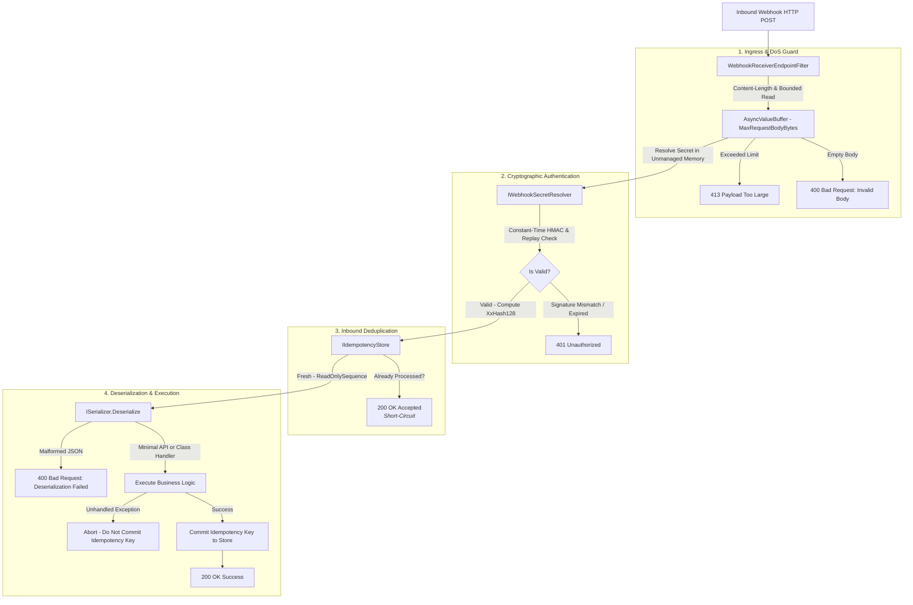

# Wiaoj.Webhooks.AspNetCore

[](https://dotnet.microsoft.com/)
[](LICENSE)

An ultra-high-throughput, zero-allocation, secure-by-default inbound webhook receiver middleware and Minimal API routing engine engineered for modern **ASP.NET Core (.NET 10)** architectures.

Built with bounded memory streaming for Denial-of-Service (DoS) protection, constant-time cryptographic HMAC verification, unmanaged memory secret protection (`Secret<byte>`), sliding-window idempotency deduplication, and declarative multi-provider policy routing.

---

## 📑 Table of Contents

- [Architectural Overview](#-architectural-overview)
- [How It Works: Inbound Execution Flow](#-how-it-works-inbound-execution-flow)
- [Key Features & Guarantees](#-key-features--guarantees)
- [Quick Start](#-quick-start)
- [Dual Invocation Models](#-dual-invocation-models)
  - [1. Minimal API Free Parameter Injection](#1-minimal-api-free-parameter-injection)
  - [2. Class-Based Handlers (CQRS / Clean Architecture)](#2-class-based-handlers-cqrs--clean-architecture)
- [Policy & Multi-Provider Architecture](#-policy--multi-provider-architecture)
- [Secret Protection & Multi-Tenancy](#-secret-protection--multi-tenancy)
- [Granular Endpoint Toggles & Overrides](#-granular-endpoint-toggles--overrides)
- [RFC 9457 Problem Details Error Contract](#-rfc-9457-problem-details-error-contract)
- [Ecosystem Packages](#-ecosystem-packages)

---

## 🏛 Architectural Overview



---

## ⚙️ How It Works: Inbound Execution Flow

Every incoming webhook request passes through a strictly orchestrated, high-performance security and processing pipeline:

1. **Ingress & DoS Defense:** Validates the `Content-Length` header against `MaxRequestBodyBytes` (default 64 KB). The body stream is read boundedly using pooled memory buffers (`AsyncValueBuffer<byte>`). If an attacker sends an unbounded chunked stream, reading terminates immediately and returns **`413 Payload Too Large`**.
2. **Cryptographic Verification:** The signature header (e.g., `Webhook-Signature`, `Stripe-Signature`) is parsed and validated in constant-time against the resolved secret key in unmanaged memory (`Secret<byte>`). Timestamps are checked against clock drift skew tolerance (default 5 minutes) to prevent replay attacks.
3. **Inbound Idempotency Check:** Derives an `IdempotencyKey` inspecting standard headers (`Webhook-Id`) or computing a SIMD-accelerated `XxHash128` payload digest. If the key was already successfully processed within the active window, the pipeline short-circuits with **`200 OK`** without executing downstream business logic.
4. **Zero-Allocation Deserialization:** The raw payload is deserialized directly from a `ReadOnlySequence<byte>` span into `TEvent` without intermediate string allocations.
5. **Handler Dispatch & Transactional Commit:** Dispatches execution to the registered Minimal API delegate or `IWebhookReceiverHandler<TEvent>`. If the handler throws an unhandled exception, the idempotency key is **never committed**, allowing upstream retry deliveries to be re-attempted safely. Upon successful completion, the key is committed and **`200 OK`** is returned.

---

## ⚡ Key Features & Guarantees

- **Zero-Allocation UTF-8 Pipeline:** Operates directly over raw UTF-8 socket buffers (`ReadOnlyMemory<byte>` and `ReadOnlySequence<byte>`). Signature verification, deduplication hashing, and JSON deserialization execute over the exact same byte buffer with zero heap string allocations.
- **Secure-by-Default (Pit of Success):** All endpoints strictly enforce signature verification, DoS stream bounding, and replay attack mitigation out of the box. Unsafe behaviors must be explicitly declared via opt-out methods (`.AllowUnsigned()`).
- **Unmanaged Secret Protection:** Secrets are kept in GC-immune unmanaged memory (`Secret<byte>`) or at-rest encrypted envelopes (`EncryptedSecret<T>`). Secrets are never interned into managed strings, preventing leakage to memory dumps or crash logs.
- **Dual Invocation Model:** Supports both **Minimal API free delegate parameter injection** (injecting `DbContext`, `ILogger`, `CancellationToken`, etc.) and **Class-based Handlers** (`IWebhookReceiverHandler<TEvent>`).
- **RFC 9457 & Native AOT Ready:** Returns standardized Problem Details for client errors (`400 Bad Request`, `401 Unauthorized`, `413 Payload Too Large`) and complies with .NET 10 Native AOT ahead-of-time compilation.

---

## 🚀 Quick Start

### 1. Register Inbound Webhook Services

```csharp
using Microsoft.Extensions.DependencyInjection;
using Wiaoj.Webhooks;

var builder = WebApplication.CreateBuilder(args);

// Register Core Webhooks and Inbound Policies
builder.Services.AddWiaojWebhooks(webhooks =>
{
    webhooks.AddInbound(inbound =>
    {
        inbound.AddPolicy("Stripe", policy => policy
            .UseHmacSha256(headerName: "Stripe-Signature")
            .WithTolerance(TimeSpan.FromMinutes(3))
            .FromConfiguration(builder.Configuration.GetSection("Webhooks:Inbound:Stripe")));
    });
});
```

### 2. Map Webhook Endpoints

```csharp
// Define Event Contract
public sealed record OrderCompletedEvent(string OrderId, decimal Amount) : IWebhookEvent;

// Map Inbound Route with Minimal API
app.MapWebhook<OrderCompletedEvent>("/api/webhooks/orders", async (
    OrderCompletedEvent @event,
    AppDbContext db,
    CancellationToken ct) =>
{
    await db.Orders.AddAsync(new Order(@event.OrderId, @event.Amount), ct);
    await db.SaveChangesAsync(ct);
})
.UsePolicy("Stripe");
```

---

## 🎮 Dual Invocation Models

### 1. Minimal API Free Parameter Injection
Define endpoint logic inline with automatic Dependency Injection parameter binding (`DbContext`, `ILogger`, `CancellationToken`, `WebhookReceiverContext<T>`):

```csharp
app.MapWebhook<PaymentCapturedEvent>("/api/webhooks/payments", async (
    PaymentCapturedEvent @event,
    WebhookReceiverContext<PaymentCapturedEvent> context,
    IPaymentService paymentService,
    ILogger<Program> logger,
    CancellationToken ct) =>
{
    logger.LogInformation("Processing payment {Id}, Raw Body: {Bytes} bytes",
        @event.PaymentId, context.RawBody.Length);

    await paymentService.CaptureAsync(@event.PaymentId, ct);
    return Results.Ok(new { status = "captured" });
})
.UsePolicy("Stripe");
```

### 2. Class-Based Handlers (CQRS / Clean Architecture)
For enterprise applications following Clean Architecture or CQRS patterns, decouple handlers into dedicated classes:

```csharp
// 1. Define Handler Implementation
public sealed class OrderCompletedWebhookHandler(ILogger<OrderCompletedWebhookHandler> logger, AppDbContext db)
    : IWebhookReceiverHandler<OrderCompletedEvent> {

    public async Task HandleAsync(WebhookReceiverContext<OrderCompletedEvent> context, CancellationToken cancellationToken = default) {
        logger.LogInformation("Order completed: {OrderId}", context.Payload.OrderId);
        await db.Orders.AddAsync(new Order(context.Payload.OrderId, context.Payload.Amount), cancellationToken);
        await db.SaveChangesAsync(cancellationToken);
    }
}

// 2. Register Handler in DI
builder.Services.AddWebhookHandler<OrderCompletedEvent, OrderCompletedWebhookHandler>();

// 3. Map Endpoint (Handler resolved automatically from DI)
app.MapWebhook<OrderCompletedEvent>("/api/webhooks/orders")
   .UsePolicy("Stripe");
```

---

## 🛡️ Policy & Multi-Provider Architecture

Configure independent named policies for multiple upstream webhook providers (Stripe, GitHub, Shopify, Internal Services):

```csharp
builder.Services.AddInboundWebhooks(inbound =>
{
    // Stripe Configuration (HMAC-SHA256, Stripe-Signature Header, 3 min tolerance)
    inbound.AddPolicy("Stripe", p => p
        .UseHmacSha256(headerName: "Stripe-Signature")
        .WithTolerance(TimeSpan.FromMinutes(3))
        .FromConfiguration(builder.Configuration.GetSection("Webhooks:Inbound:Stripe")));

    // GitHub Configuration (HMAC-SHA256, X-Hub-Signature-256 Header, 5 min tolerance)
    inbound.AddPolicy("GitHub", p => p
        .UseHmacSha256(headerName: "X-Hub-Signature-256")
        .WithTolerance(TimeSpan.FromMinutes(5))
        .FromConfiguration(builder.Configuration.GetSection("Webhooks:Inbound:GitHub")));
});
```

Binding from `appsettings.json`:
```json
{
  "Webhooks": {
    "Inbound": {
      "Stripe": {
        "Secret": "whsec_live_1234567890abcdef",
        "Tolerance": "00:03:00",
        "MaxBodyBytes": 131072
      },
      "GitHub": {
        "Secret": "ghsec_webhook_secret_key",
        "Tolerance": "00:05:00"
      }
    }
  }
}
```

---

## 🔐 Secret Protection & Multi-Tenancy

### 1. Unmanaged Memory (`Secret<byte>`)
Hold static keys in GC-immune memory that will not leak to memory dumps:
```csharp
using var secret = Secret.From("whsec_live_12345");
app.MapWebhook<OrderCompletedEvent>("/webhooks/orders")
   .WithSecret(secret);
```

### 2. At-Rest Encrypted Secret (`EncryptedSecret<T>`)
Encrypt signing secrets at rest with `Wiaoj.Security` and unprotect them on-the-fly:
```csharp
app.MapWebhook<OrderCompletedEvent>("/webhooks/orders")
   .WithEncryptedSecret(encryptedSecret, secretProtector);
```

### 3. Dynamic Multi-Tenant Resolution (B2B SaaS)
Dynamically resolve customer signing secrets from a database or vault based on request headers:

```csharp
public sealed class TenantDatabaseSecretResolver : IWebhookSecretResolver {
    public async ValueTask<bool> VerifyAsync(
        HttpContext httpContext,
        ReadOnlyMemory<byte> payload,
        string signatureHeader,
        IWebhookSigner signer,
        TimeSpan tolerance,
        UnixTimestamp currentTimestamp,
        CancellationToken cancellationToken = default) {

        string tenantId = httpContext.Request.Headers["X-Tenant-Id"].ToString();
        using Secret<byte> tenantSecret = await FetchTenantSecretFromDbAsync(tenantId, cancellationToken);

        return signer.Verify(payload.Span, signatureHeader, tenantSecret, tolerance, currentTimestamp);
    }
}
```

---

## 🎛 Granular Endpoint Toggles & Overrides

Override or customize policy behaviors directly on route definitions:

```csharp
app.MapWebhook<DiagnosticEvent>("/webhooks/internal")
   .AllowUnsigned()                  // Disables signature requirement for testing/DMZ
   .DisableIdempotency()             // Disables deduplication cache
   .WithMaxBodySize(1024 * 1024)     // Increases DoS stream limit to 1 MB
   .WithTolerance(TimeSpan.FromMinutes(10)) // Extends clock drift tolerance
   .WithHeaderName("X-Custom-Signature");   // Custom signature header
```

---

## 📋 RFC 9457 Problem Details Error Contract

All client errors emit standardized HTTP Problem Details:

| Status Code | Title | Trigger Condition |
|---|---|---|
| **`400 Bad Request`** | `Invalid Webhook Body` | Request body is empty or contained 0 bytes. |
| **`400 Bad Request`** | `Webhook Deserialization Failed` | Request payload could not be deserialized into `TEvent`. |
| **`401 Unauthorized`** | `Webhook Signature Verification Failed` | Signature header is missing, expired (replay tolerance exceeded), or HMAC mismatch. |
| **`413 Payload Too Large`** | `Webhook Payload Too Large` | Request body exceeded configured `MaxRequestBodyBytes`. |
| **`200 OK`** | *(Empty Body)* | Successfully processed OR duplicate event intercepted by `IIdempotencyStore`. |

---

## 📦 Ecosystem Packages

| Package | Description | Reference Link |
|---|---|---|
| **`Wiaoj.Webhooks.Abstractions`** | Core contracts, value objects (`WebhookEndpointId`, `WebhookPartitionKey`, `IdempotencyKey`), and contexts with zero external dependencies. | [README](../Wiaoj.Webhooks.Abstractions/README.md) |
| **`Wiaoj.Webhooks`** | Core outbound dispatch engine, partitioning concurrency, HTTP deliverer, HMAC signers, and resilience policies. | [README](../Wiaoj.Webhooks/README.md) |
| **`Wiaoj.Webhooks.Transports.InMemory`** | Bounded channel transport and composed `ShardedWebhookTransport` partition router. | [README](../Wiaoj.Webhooks.Transports.InMemory/README.md) |
| **`Wiaoj.Webhooks.BloomFilter`** | O(1) duplicate webhook suppression plugin backed by `Wiaoj.BloomFilter`. | [README](../Wiaoj.Webhooks.BloomFilter/README.md) |
| **`Wiaoj.Webhooks.DistributedCounter`** | Distributed rate limiting middleware plugin backed by `Wiaoj.DistributedCounter`. | [README](../Wiaoj.Webhooks.DistributedCounter/README.md) |

---

## 📄 License

This package is part of the **Wiaoj.Webhooks** ecosystem and is licensed under the [MIT License](../../LICENSE).