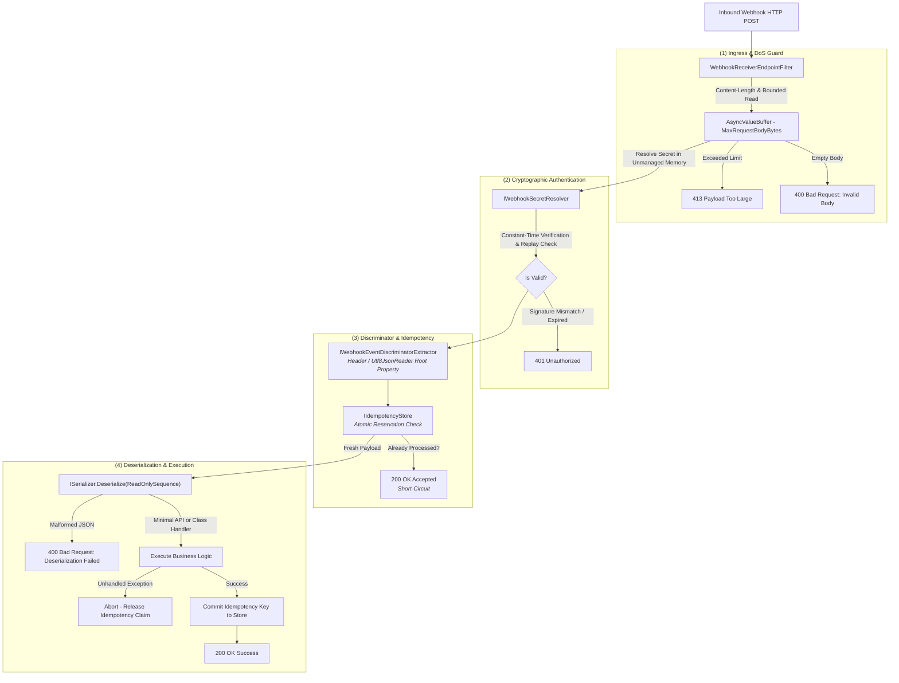

# Wiaoj.Webhooks.AspNetCore

[](https://dotnet.microsoft.com/)
[](LICENSE)

An enterprise-grade inbound webhook receiver middleware and Minimal API routing engine engineered for modern **ASP.NET Core (.NET 10)** architectures.

Provides bounded memory streaming for Denial-of-Service (DoS) protection, constant-time cryptographic HMAC verification, unmanaged memory secret protection (`Secret<byte>`), sliding-window idempotency deduplication, configurable event discriminator extractors, and declarative multi-provider policy routing.

---

## 📑 Table of Contents

- [Architectural Overview](#-architectural-overview)
- [How It Works: Inbound Execution Flow](#-how-it-works-inbound-execution-flow)
- [Key Components & Capabilities](#-key-components--capabilities)
- [Quick Start](#-quick-start)
- [Event Discriminator Extraction](#-event-discriminator-extraction)
  - [1. Header Discriminator Extractor](#1-header-discriminator-extractor)
  - [2. JSON Property Discriminator Extractor](#2-json-property-discriminator-extractor)
  - [3. Composite Fallback Extractor](#3-composite-fallback-extractor)
- [Dual Invocation Models](#-dual-invocation-models)
  - [1. Minimal API Free Parameter Injection](#1-minimal-api-free-parameter-injection)
  - [2. Class-Based Handlers (CQRS / Clean Architecture)](#2-class-based-handlers-cqrs--clean-architecture)
- [Policy & Multi-Provider Architecture](#-policy--multi-provider-architecture)
- [Secret Protection & Dynamic Resolution](#-secret-protection--dynamic-resolution)
  - [1. Unmanaged Memory (`Secret<byte>`)](#1-unmanaged-memory-secretbyte)
  - [2. At-Rest Encrypted Secret (`EncryptedSecret<T>`)](#2-at-rest-encrypted-secret-encryptedsecrett)
  - [3. Dynamic Multi-Tenant Resolution (B2B SaaS)](#3-dynamic-multi-tenant-resolution-b2b-saas)
- [RFC 9457 Problem Details Error Contract](#-rfc-9457-problem-details-error-contract)
- [Integration Testing with `WebApplicationFactory`](#-integration-testing-with-webapplicationfactory)
- [Ecosystem Packages](#-ecosystem-packages)

---

## 🏛 Architectural Overview



---

## ⚙️ How It Works: Inbound Execution Flow

Every incoming webhook request passes through an orchestrated security and processing pipeline:

1. **Ingress & DoS Defense:** Validates the `Content-Length` header against `MaxRequestBodyBytes` (default 64 KB). The body stream is read boundedly using pooled memory buffers (`AsyncValueBuffer<byte>`). If an unbuffered chunked stream exceeds this limit, reading terminates immediately and returns **`413 Payload Too Large`**.
2. **Cryptographic Verification:** The signature header (`Webhook-Signature`, `Stripe-Signature`, `X-Hub-Signature-256`) is parsed and validated in constant-time against the resolved secret key in unmanaged memory (`Secret<byte>`) or an asymmetric public key. Timestamps are checked against clock drift skew tolerance (default 5 minutes) to prevent replay attacks.
3. **Discriminator Extraction:** The wire-format event name is derived using the configured `IWebhookEventDiscriminatorExtractor` (from request headers like `X-GitHub-Event` or directly from JSON payload root properties like `"type"` or `"event"` using `Utf8JsonReader`).
4. **Inbound Idempotency Check:** Derives an `IdempotencyKey` inspecting delivery headers (`Webhook-Id`) or computing a 128-bit hash (`XxHash128`) over the payload bytes. If the key was already successfully processed within the active window, the pipeline short-circuits with **`200 OK`**.
5. **Deserialization & Handler Dispatch:** The raw payload is deserialized directly into the target model type. If execution succeeds, the idempotency key is committed to the store; if execution throws, the reservation is released so upstream retries can be reprocessed.

---

## ⚡ Key Components & Capabilities

- **Event Discriminator Extractors:** Configurable extraction strategies (`HeaderEventDiscriminatorExtractor`, `JsonPropertyEventDiscriminatorExtractor`, `CompositeEventDiscriminatorExtractor`) supporting single-header and JSON root property lookups with parameter pollution protection.
- **DoS & Replay Defense:** Bounded request streaming with `AsyncValueBuffer<byte>` preventing memory exhaustion, combined with strict clock skew tolerance windows.
- **Unmanaged Secret Protection:** Secrets are kept in GC-immune native memory (`Secret<byte>`) or at-rest encrypted envelopes (`EncryptedSecret<T>`), preventing plain-text secret leakage to heap dumps.
- **Dual Invocation Models:** Supports both **Minimal API delegate parameter injection** (injecting services, `HttpContext`, `CancellationToken`, `WebhookReceiverContext<T>`) and **Class-based Handlers** (`IWebhookReceiverHandler<TEvent>`).
- **RFC 9457 Problem Details:** Client errors (`400 Bad Request`, `401 Unauthorized`, `413 Payload Too Large`) emit standardized Problem Details responses.

---

## 🚀 Quick Start

### 1. Register Core Engine and Inbound Policies

```csharp
using Microsoft.Extensions.DependencyInjection;
using Wiaoj.Webhooks;

var builder = WebApplication.CreateBuilder(args);

builder.Services.AddWiaojWebhooks(webhooks =>
{
    webhooks.AddInbound(inbound =>
    {
        inbound.AddPolicy("Stripe", policy => policy
            .UseHmacSha256(headerName: "Stripe-Signature")
            .WithTolerance(TimeSpan.FromMinutes(3))
            .WithEventFromJsonProperty("type")
            .FromConfiguration(builder.Configuration.GetSection("Webhooks:Inbound:Stripe")));
    });
});
```

### 2. Map Inbound Webhook Endpoint

```csharp
// Define Event Payload Model
public sealed record OrderCompletedEvent(string OrderId, decimal Amount) : IWebhookEvent;

// Map Inbound Route
app.MapWebhook<OrderCompletedEvent>("/api/webhooks/orders", async (
    OrderCompletedEvent @event,
    AppDbContext db,
    CancellationToken ct) =>
{
    await db.Orders.AddAsync(new Order(@event.OrderId, @event.Amount), ct);
    await db.SaveChangesAsync(ct);
})
.UsePolicy("Stripe");
```

---

## 🔍 Event Discriminator Extraction

The library provides dedicated strategies to extract wire-format event names across various webhook providers:

### 1. Header Discriminator Extractor
Inspects a specific HTTP request header (e.g. `X-GitHub-Event`, `Webhook-Event`, `X-Shopify-Topic`). Enforces strict single-header validation to prevent HTTP header pollution attacks.

```csharp
policy.WithEventFromHeader("X-GitHub-Event");
```

### 2. JSON Property Discriminator Extractor
Scans the root-level JSON properties of the raw UTF-8 payload using `Utf8JsonReader` without allocating string instances for unmatched tokens.

```csharp
policy.WithEventFromJsonProperty("type"); // Matches {"type": "payment_intent.succeeded"}
```

### 3. Composite Fallback Extractor
Evaluates multiple extractors in sequence. The default configuration checks the `Webhook-Event` header first, followed by root `"type"` and `"event"` JSON properties.

```csharp
policy.WithEventExtractor(new CompositeEventDiscriminatorExtractor(
    new HeaderEventDiscriminatorExtractor("X-Custom-Event"),
    new JsonPropertyEventDiscriminatorExtractor("event_type")
));
```

---

## 🎮 Dual Invocation Models

### 1. Minimal API Free Parameter Injection
Inject domain payloads alongside framework and application services directly into the endpoint delegate:

```csharp
app.MapWebhook<PaymentCapturedEvent>("/api/webhooks/payments", async (
    PaymentCapturedEvent @event,
    WebhookReceiverContext<PaymentCapturedEvent> context,
    IPaymentService paymentService,
    ILogger<Program> logger,
    CancellationToken ct) =>
{
    logger.LogInformation("Processing payment {Id}, Raw Body: {Bytes} bytes",
        @event.PaymentId, context.RawBody.Length);

    await paymentService.CaptureAsync(@event.PaymentId, ct);
    return Results.Ok();
})
.UsePolicy("Stripe");
```

### 2. Class-Based Handlers (CQRS / Clean Architecture)
Decouple endpoint mapping from business logic by registering dedicated handler classes:

```csharp
// 1. Define Handler Implementation
public sealed class OrderCompletedWebhookHandler(ILogger<OrderCompletedWebhookHandler> logger, AppDbContext db)
    : IWebhookReceiverHandler<OrderCompletedEvent> {

    public async Task HandleAsync(WebhookReceiverContext<OrderCompletedEvent> context, CancellationToken cancellationToken = default) {
        logger.LogInformation("Order completed: {OrderId}", context.Payload.OrderId);
        await db.Orders.AddAsync(new Order(context.Payload.OrderId, context.Payload.Amount), cancellationToken);
        await db.SaveChangesAsync(cancellationToken);
    }
}

// 2. Register Handler in DI
builder.Services.AddWebhookHandler<OrderCompletedEvent, OrderCompletedWebhookHandler>();

// 3. Map Endpoint (Handler resolved automatically from DI container)
app.MapWebhook<OrderCompletedEvent>("/api/webhooks/orders")
   .UsePolicy("Stripe");
```

---

## 🛡️ Policy & Multi-Provider Architecture

Configure multiple upstream webhook providers in the same application, each with isolated security headers, clock tolerances, and secret keys:

```csharp
builder.Services.AddInboundWebhooks(inbound =>
{
    // Stripe Configuration
    inbound.AddPolicy("Stripe", p => p
        .UseHmacSha256(headerName: "Stripe-Signature")
        .WithTolerance(TimeSpan.FromMinutes(3))
        .WithEventFromJsonProperty("type")
        .FromConfiguration(builder.Configuration.GetSection("Webhooks:Inbound:Stripe")));

    // GitHub Configuration
    inbound.AddPolicy("GitHub", p => p
        .WithSigner<GitHubWebhookSigner>()
        .WithTolerance(TimeSpan.FromMinutes(5))
        .WithEventFromHeader("X-GitHub-Event")
        .FromConfiguration(builder.Configuration.GetSection("Webhooks:Inbound:GitHub")));
});
```

Binding from `appsettings.json`:
```json
{
  "Webhooks": {
    "Inbound": {
      "Stripe": {
        "Secret": "whsec_live_1234567890abcdef",
        "Tolerance": "00:03:00",
        "MaxBodyBytes": 131072
      },
      "GitHub": {
        "Secret": "ghsec_webhook_secret_key",
        "Tolerance": "00:05:00"
      }
    }
  }
}
```

---

## 🔐 Secret Protection & Dynamic Resolution

### 1. Unmanaged Memory (`Secret<byte>`)
```csharp
using var secret = Secret.From("whsec_live_12345");
app.MapWebhook<OrderCompletedEvent>("/webhooks/orders")
   .WithSecret(secret);
```

### 2. At-Rest Encrypted Secret (`EncryptedSecret<T>`)
```csharp
app.MapWebhook<OrderCompletedEvent>("/webhooks/orders")
   .WithEncryptedSecret(encryptedSecret, secretProtector);
```

### 3. Dynamic Multi-Tenant Resolution (B2B SaaS)
Dynamically resolve signing keys from databases or secret vaults based on request headers:

```csharp
public sealed class TenantDatabaseSecretResolver : IWebhookSecretResolver {
    public async ValueTask<bool> VerifyAsync(
        HttpContext httpContext,
        ReadOnlyMemory<byte> payload,
        string signatureHeader,
        IWebhookSigner signer,
        TimeSpan tolerance,
        UnixTimestamp currentTimestamp,
        CancellationToken cancellationToken = default) {

        string tenantId = httpContext.Request.Headers["X-Tenant-Id"].ToString();
        using Secret<byte> tenantSecret = await FetchTenantSecretFromDbAsync(tenantId, cancellationToken);

        return signer.Verify(payload.Span, signatureHeader, tenantSecret, tolerance, currentTimestamp);
    }
}
```

---

## 📋 RFC 9457 Problem Details Error Contract

All inbound client errors emit standardized HTTP Problem Details:

| Status Code | Title | Trigger Condition |
|---|---|---|
| **`400 Bad Request`** | `Invalid Webhook Body` | Request body is empty or contains 0 bytes. |
| **`400 Bad Request`** | `Webhook Deserialization Failed` | Request payload cannot be deserialized into `TEvent`. |
| **`401 Unauthorized`** | `Webhook Signature Verification Failed` | Signature header is missing, expired (replay tolerance exceeded), or HMAC mismatch. |
| **`413 Payload Too Large`** | `Webhook Payload Too Large` | Request body exceeds configured `MaxRequestBodyBytes`. |
| **`200 OK`** | *(Empty Body)* | Successfully processed OR duplicate event intercepted by `IIdempotencyStore`. |

---

## 🧪 Integration Testing with `WebApplicationFactory`

```csharp
public sealed class WebhookIntegrationTests : IClassFixture<WebApplicationFactory<Program>> {
    private readonly HttpClient _client;
    private readonly HmacSha256WebhookSigner _signer = new();
    private static readonly byte[] SecretKey = "whsec_test_secret_key"u8.ToArray();

    public WebhookIntegrationTests(WebApplicationFactory<Program> factory) {
        _client = factory.CreateClient();
    }

    [Fact]
    public async Task PostWebhook_WithValidSignature_Returns200Ok() {
        const string payload = """{"OrderId":"ORD-100","Amount":49.99}""";
        UnixTimestamp now = UnixTimestamp.Now;

        WebhookSignature signature = _signer.Sign(Encoding.UTF8.GetBytes(payload), SecretKey, now);

        HttpRequestMessage request = new(HttpMethod.Post, "/api/webhooks/orders") {
            Content = new StringContent(payload, Encoding.UTF8, "application/json")
        };
        request.Headers.Add("Stripe-Signature", signature.HeaderValue);

        HttpResponseMessage response = await _client.SendAsync(request);

        Assert.Equal(HttpStatusCode.OK, response.StatusCode);
    }
}
```

---

## 📦 Ecosystem Packages

| Package | Description | Reference Link |
|---|---|---|
| **`Wiaoj.Webhooks.Abstractions`** | Core contracts, value objects (`WebhookPartitionKey`, `WebhookEndpointId`, `IdempotencyKey`), and contexts with zero external dependencies. | [README](../Wiaoj.Webhooks.Abstractions/README.md) |
| **`Wiaoj.Webhooks`** | Core outbound dispatch engine, partitioning concurrency, HTTP deliverer, HMAC signers, and resilience policies. | [README](../Wiaoj.Webhooks/README.md) |
| **`Wiaoj.Webhooks.Signing.Asymmetric`** | Asymmetric cryptographic signers supporting RSA (PS256/RS256), ECDSA (ES256/ES384/ES512), and Ed25519. | [README](../Wiaoj.Webhooks.Signing.Asymmetric/README.md) |
| **`Wiaoj.Webhooks.Transports.InMemory`** | In-memory channel transport and `ShardedWebhookTransport` partition router. | [README](../Wiaoj.Webhooks.Transports.InMemory/README.md) |
| **`Wiaoj.Webhooks.BloomFilter`** | Duplicate webhook suppression plugin backed by `Wiaoj.BloomFilter`. | [README](../Wiaoj.Webhooks.BloomFilter/README.md) |
| **`Wiaoj.Webhooks.DistributedCounter`** | Distributed rate limiting middleware plugin backed by `Wiaoj.DistributedCounter`. | [README](../Wiaoj.Webhooks.DistributedCounter/README.md) |

---

## 📄 License

This package is part of the **Wiaoj.Webhooks** ecosystem and is licensed under the [MIT License](../../LICENSE).