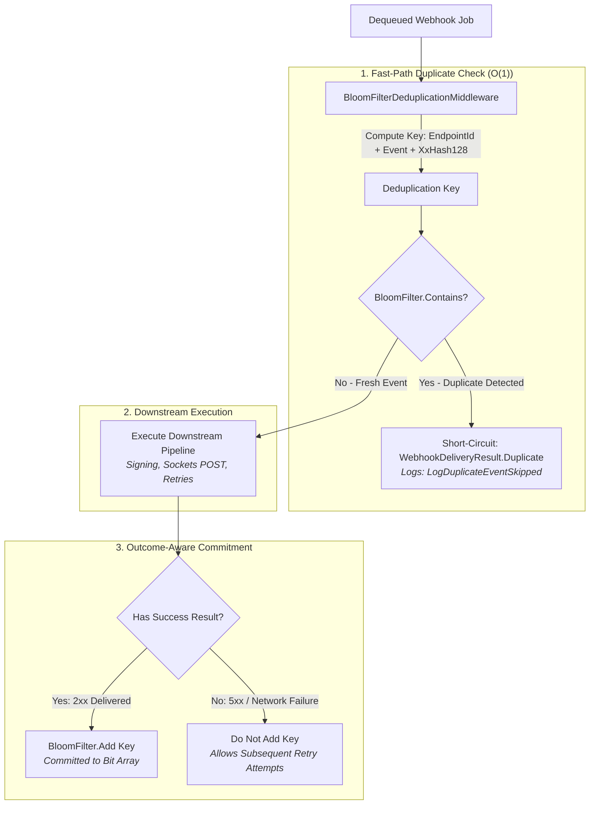

# Wiaoj.Webhooks.BloomFilter

[](https://dotnet.microsoft.com/)
[](LICENSE)

An ultra-high-performance, probabilistic, zero-database duplicate event deduplication middleware plugin for **Wiaoj.Webhooks** powered by `Wiaoj.BloomFilter`.

Intercepts duplicate webhook deliveries in sub-microsecond timeframes ($O(1)$ memory complexity) directly within the outbound pipeline, completely eliminating unnecessary database or Redis round-trips.

---

## 📑 Table of Contents

- [Architectural Overview](#-architectural-overview)
- [How It Works: Deduplication Flow](#-how-it-works-deduplication-flow)
- [Key Features & Guarantees](#-key-features--guarantees)
- [Quick Start](#-quick-start)
- [Registration & Resolution Patterns](#-registration--resolution-patterns)
  - [1. Default DI Service Resolution](#1-default-di-service-resolution)
  - [2. Named Keyed Filter Resolution](#2-named-keyed-filter-resolution)
  - [3. Direct Instance Registration](#3-direct-instance-registration)
- [Configuration & Key Selectors](#-configuration--key-selectors)
- [Structured Logging & Diagnostics](#-structured-logging--diagnostics)
- [Ecosystem Packages](#-ecosystem-packages)

---

## 🏛 Architectural Overview



---

## ⚙️ How It Works: Deduplication Flow

1. **Deterministic Key Extraction:** Derives a unique deduplication key combining the target `EndpointId`, domain event type name, and SIMD-accelerated 128-bit payload digest (`XxHash128`).
2. **Sub-Microsecond Interception:** Checks the in-memory bit vector (`IBloomFilter.Contains`). If the key has already been processed, the pipeline short-circuits immediately with **`WebhookDeliveryResult.Duplicate`**, avoiding redundant HTTP requests and third-party rate limits.
3. **Outcome-Aware Commitment:** If the delivery fails (e.g. HTTP 503, network timeout), the key is **never added to the filter**. This guarantees that transient errors can be safely retried without false-positive deduplication blocks. The key is committed only upon confirmed successful delivery (`2xx OK`).

---

## ⚡ Key Features & Guarantees

- **$O(1)$ Zero-IO Efficiency:** Evaluates duplicate status purely in RAM using vectorized bit-level operations with zero database, cache, or network I/O.
- **Outcome-Aware State Transitions:** Failed delivery attempts do not poison the Bloom filter; retry policies can continue delivering until transient errors resolve.
- **SIMD Hashing Integration:** Default key selector computes payload signatures using hardware-accelerated 128-bit digests (`XxHash128`).
- **Flexible Dependency Injection:** Supports unnamed singleton filters, keyed service filters, and explicit instances.
- **Observability Built-In:** Emits structured high-performance logs (`[LoggerMessage]` Event ID `3201`) capturing endpoint ID and skipped deduplication keys.

---

## 🚀 Quick Start

### 1. Register Supporting BloomFilter and Webhooks

```csharp
using Microsoft.Extensions.DependencyInjection;
using Wiaoj.BloomFilter;
using Wiaoj.Webhooks;
using Wiaoj.Webhooks.BloomFilter;

var builder = WebApplication.CreateBuilder(args);

// 1. Register Wiaoj.BloomFilter
builder.Services.AddBloomFilter(bf => 
    bf.AddFilter("webhook-dedup", expectedItems: 1_000_000, errorRate: 0.001));
builder.Services.AddSingleton<IBloomFilter>(sp => 
    sp.GetRequiredKeyedService<IBloomFilter>("webhook-dedup"));

// 2. Register Webhooks with BloomFilter Deduplication
builder.Services.AddWiaojWebhooks(webhooks =>
{
    webhooks.UseInMemoryTransport()
            .UseBloomFilterDeduplication() // Uses IBloomFilter from DI
            .UseHmacSha256Signing();
});
```

---

## 🧩 Registration & Resolution Patterns

### 1. Default DI Service Resolution
Resolves the default unnamed `IBloomFilter` from the DI container:

```csharp
webhooks.UseBloomFilterDeduplication(options =>
{
    options.Capacity = 500_000;
    options.ErrorRate = 0.005; // 0.5% acceptable false-positive probability
});
```

### 2. Named Keyed Filter Resolution
Resolves a specific keyed Bloom filter by its registration name:

```csharp
webhooks.UseBloomFilterDeduplication("webhook-dedup", options =>
{
    options.KeySelector = ctx => $"{ctx.Endpoint.Id.Value}:{ctx.SerializedPayload}";
});
```

### 3. Direct Instance Registration
Passes a pre-configured `IBloomFilter` instance directly:

```csharp
IBloomFilter customFilter = ...;
webhooks.UseBloomFilterDeduplication(customFilter);
```

---

## ⚙️ Configuration & Key Selectors

```csharp
public sealed class BloomFilterDeduplicationOptions {
    /// <summary>Expected capacity of unique events stored. Default is 1,000,000.</summary>
    public long Capacity { get; set; } = 1_000_000;

    /// <summary>Desired false positive probability rate. Default is 0.001 (0.1%).</summary>
    public double ErrorRate { get; set; } = 0.001;

    /// <summary>Custom strategy to derive deduplication keys from delivery contexts.</summary>
    public Func<WebhookDeliveryContext, string> KeySelector { get; set; } = DefaultKeySelector;
}
```

Custom domain key selector example:
```csharp
webhooks.UseBloomFilterDeduplication(options =>
{
    // Deduplicate strictly by CustomerId and domain Event Id
    options.KeySelector = ctx => ctx.Event is IOrderEvent order
        ? $"{ctx.Endpoint.Id.Value}:{order.OrderId}"
        : BloomFilterDeduplicationOptions.DefaultKeySelector(ctx);
});
```

---

## 📊 Structured Logging & Diagnostics

When duplicate events are intercepted, structured zero-allocation log events are emitted:

```text
[Information] EventId: 3201, Message: Duplicate webhook event detected for endpoint 'ep_customer_1' with deduplication key 'acme:OrderCreated:4f53cd...'. Delivery skipped.
```

---

## 📦 Ecosystem Packages

| Package | Description | Reference Link |
|---|---|---|
| **`Wiaoj.Webhooks.Abstractions`** | Core contracts, value objects (`WebhookPartitionKey`, `WebhookEndpointId`, `IdempotencyKey`), and contexts. | [README](../Wiaoj.Webhooks.Abstractions/README.md) |
| **`Wiaoj.Webhooks`** | Core outbound dispatch engine, partitioning concurrency, HTTP deliverer, HMAC signers, and resilience policies. | [README](../Wiaoj.Webhooks/README.md) |
| **`Wiaoj.Webhooks.AspNetCore`** | Inbound webhook receiver engine, DoS stream protection, policy routing, and Minimal API integration. | [README](../Wiaoj.Webhooks.AspNetCore/README.md) |
| **`Wiaoj.Webhooks.Transports.InMemory`** | In-memory channel transport and `ShardedWebhookTransport` partition router. | [README](../Wiaoj.Webhooks.Transports.InMemory/README.md) |
| **`Wiaoj.Webhooks.DistributedCounter`** | Distributed rate limiting middleware plugin backed by `Wiaoj.DistributedCounter`. | [README](../Wiaoj.Webhooks.DistributedCounter/README.md) |

---

## 📄 License

This package is part of the **Wiaoj.Webhooks** ecosystem and is licensed under the [MIT License](../../LICENSE).