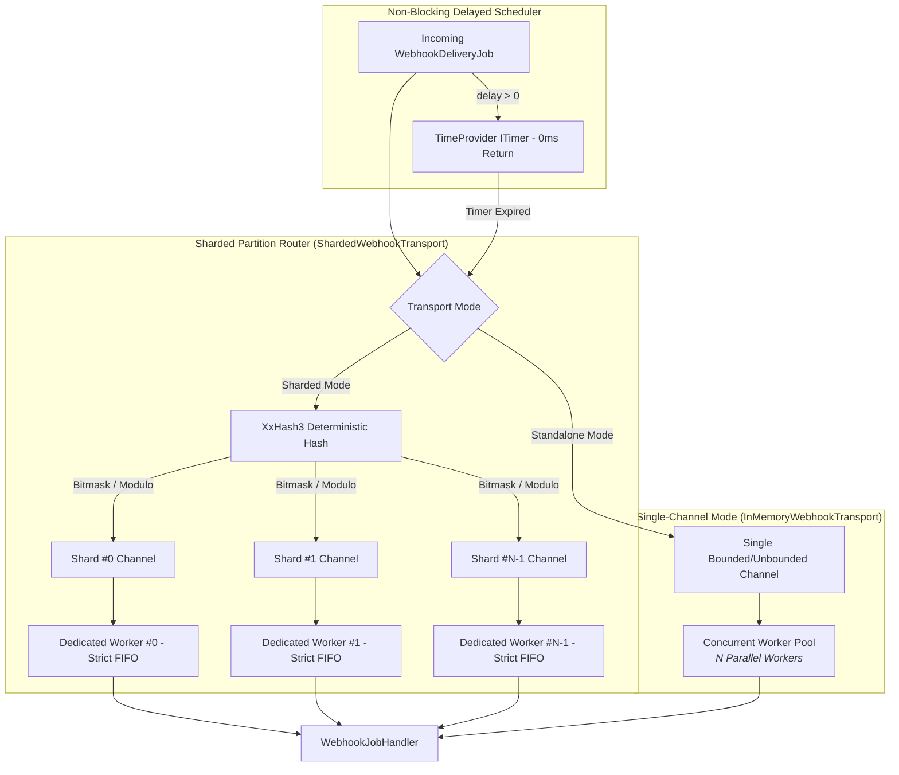

# Wiaoj.Webhooks.Transports.InMemory

[](https://dotnet.microsoft.com/)
[](LICENSE)

An ultra-high-throughput, non-blocking in-process execution transport and composed partition router for **Wiaoj.Webhooks** powered by `System.Threading.Channels`, `TimeProvider` delayed schedulers, and SIMD-accelerated deterministic hashing (`XxHash3`).

Engineered for single-node deployments, high-performance integration test suites, and massive in-process parallel delivery with **lock-free strict FIFO guarantees per partition**.

---

## 📑 Table of Contents

- [Architectural Overview](#-architectural-overview)
- [How It Works: Partition Sharding & Ingress](#-how-it-works-partition-sharding--ingress)
- [Key Features & Guarantees](#-key-features--guarantees)
- [Quick Start](#-quick-start)
- [Deployment Modes](#-deployment-modes)
  - [1. Standalone Single-Channel Transport](#1-standalone-single-channel-transport)
  - [2. Composed Sharded Transport (Lock-Free FIFO)](#2-composed-sharded-transport-lock-free-fifo)
- [Delayed Scheduling & Backpressure](#-delayed-scheduling--backpressure)
- [Configuration Options](#-configuration-options)
- [Ecosystem Packages](#-ecosystem-packages)

---

## 🏛 Architectural Overview



---

## ⚙️ How It Works: Partition Sharding & Ingress

1. **Deterministic SIMD Routing:** When a delivery is enqueued, `ShardedWebhookTransport` extracts the `WebhookPartitionKey` and computes its 64-bit digest via SIMD hardware-accelerated **`XxHash3`**.
2. **Single-Cycle Bitmasking:** If the shard count is a power of two ($N \in \{2, 4, 8, 16, 64\}$), shard index calculation executes in **1 CPU clock cycle** using bitwise masking (`hash & (shardCount - 1)`).
3. **Lock-Free FIFO Isolation:** Each shard channel is strictly consumed by a single dedicated worker loop (`SingleReader = true`). Jobs belonging to the same partition key land on the exact same shard, guaranteeing **100% strict FIFO sequence** with zero synchronization locks or thread contention.
4. **Non-Blocking Timer Scheduling:** Delayed deliveries (such as retry backoffs or sliding-window rate limit deferrals) are buffered by `InMemoryDelayedScheduler` using `TimeProvider` timers. The caller thread returns in **0 ms** without blocking, and when the timer expires, the job flushes into its target shard channel.

---

## ⚡ Key Features & Guarantees

- **Lock-Free FIFO Message Ordering:** Eliminates cross-thread semaphore locks by pinning partition keys directly to dedicated worker channels.
- **Cross-Process Determinizm (`XxHash3`):** Does not rely on randomized `string.GetHashCode()`, ensuring identical partition routing across process restarts and test suites.
- **Zero-Allocation Ingress:** `ChannelWriter.WriteAsync` operates directly over immutable `WebhookDeliveryJob` records with zero heap copying.
- **Immediate Non-Blocking Returns:** Enqueueing with delays (e.g. `TimeSpan.FromSeconds(30)`) completes instantaneously and registers lightweight OS-level timers.
- **Graceful Drain on Shutdown:** `InMemoryWebhookConsumer` respects cancellation tokens and provides configurable drain timeouts during host termination.

---

## 🚀 Quick Start

### 1. Register Webhooks with Sharded Transport

```csharp
using Microsoft.Extensions.DependencyInjection;
using Wiaoj.Webhooks;

var builder = WebApplication.CreateBuilder(args);

// Register Webhooks Engine with 8 Sharded Channels
builder.Services.AddWiaojWebhooks(webhooks =>
{
    webhooks.UseShardedInMemoryTransport(
                shardCount: 8, 
                capacityPerShard: 10_000)
            .UseHmacSha256Signing()
            .UseExponentialBackoffRetry();
});
```

### 2. Dispatch with Partition Key

```csharp
public class OrderService(IWebhookDispatcher dispatcher)
{
    public async Task CompleteOrderAsync(string orderId, decimal amount, CancellationToken ct)
    {
        var @event = new OrderCreatedWebhookEvent(orderId, amount);
        
        // Dispatches with explicit partition key to ensure order-level FIFO
        await dispatcher.DispatchAsync(
            endpointId: new WebhookEndpointId("customer-1"),
            payload: @event,
            partitionKey: orderId,
            cancellationToken: ct);
    }
}
```

---

## 🧩 Deployment Modes

### 1. Standalone Single-Channel Transport
Best for simple single-node architectures or local testing where global concurrency is sufficient:

```csharp
webhooks.UseInMemoryTransport(capacity: 50_000);
```

Or configure options directly:
```csharp
webhooks.UseInMemoryTransport(options =>
{
    options.Concurrency = 16;              // 16 parallel worker loops
    options.Capacity = 100_000;            // Apply backpressure at 100k buffered jobs
    options.DrainTimeout = TimeSpan.FromSeconds(10);
});
```

### 2. Composed Sharded Transport (Lock-Free FIFO)
Best for high-throughput multi-tenant architectures where events per customer/order must not be processed out of order:

```csharp
webhooks.UseShardedInMemoryTransport(
    shardCount: Environment.ProcessorCount * 2,
    capacityPerShard: 5_000);
```

---

## ⏱️ Delayed Scheduling & Backpressure

The transport integrates seamless delayed scheduling for resilience policies:

```csharp
// Returns immediately (0ms) to caller; flushes into the channel after 5 seconds
await transport.EnqueueAsync(job, delay: TimeSpan.FromSeconds(5), cancellationToken);
```

When bounded channels fill up to their configured `Capacity`, `ChannelWriter.WriteAsync` asynchronously yields and applies backpressure to the dispatcher without throwing buffer overflow exceptions.

---

## ⚙️ Configuration Options

```csharp
public sealed class InMemoryWebhookTransportOptions {
    /// <summary>
    /// Number of concurrent worker loops actively consuming jobs.
    /// Default is Environment.ProcessorCount * 2 (minimum 4).
    /// </summary>
    public int Concurrency { get; set; } = Math.Max(Environment.ProcessorCount * 2, 4);

    /// <summary>
    /// Maximum bounded channel capacity before backpressure is applied.
    /// When null, an unbounded channel is used.
    /// </summary>
    public int? Capacity { get; set; }

    /// <summary>
    /// Maximum duration to wait for in-flight and buffered jobs to drain during application shutdown.
    /// Default is 5 seconds.
    /// </summary>
    public TimeSpan DrainTimeout { get; set; } = TimeSpan.FromSeconds(5);
}
```

---

## 📦 Ecosystem Packages

| Package | Description | Reference Link |
|---|---|---|
| **`Wiaoj.Webhooks.Abstractions`** | Core contracts, value objects (`WebhookPartitionKey`, `WebhookEndpointId`, `IdempotencyKey`), and contexts. | [README](../Wiaoj.Webhooks.Abstractions/README.md) |
| **`Wiaoj.Webhooks`** | Core outbound dispatch engine, partitioning concurrency, HTTP deliverer, HMAC signers, and resilience policies. | [README](../Wiaoj.Webhooks/README.md) |
| **`Wiaoj.Webhooks.AspNetCore`** | Inbound webhook receiver engine, DoS stream protection, policy routing, and Minimal API integration. | [README](../Wiaoj.Webhooks.AspNetCore/README.md) |
| **`Wiaoj.Webhooks.BloomFilter`** | O(1) duplicate webhook suppression plugin backed by `Wiaoj.BloomFilter`. | [README](../Wiaoj.Webhooks.BloomFilter/README.md) |
| **`Wiaoj.Webhooks.DistributedCounter`** | Distributed rate limiting middleware plugin backed by `Wiaoj.DistributedCounter`. | [README](../Wiaoj.Webhooks.DistributedCounter/README.md) |

---

## 📄 License

This package is part of the **Wiaoj.Webhooks** ecosystem and is licensed under the [MIT License](../../LICENSE).