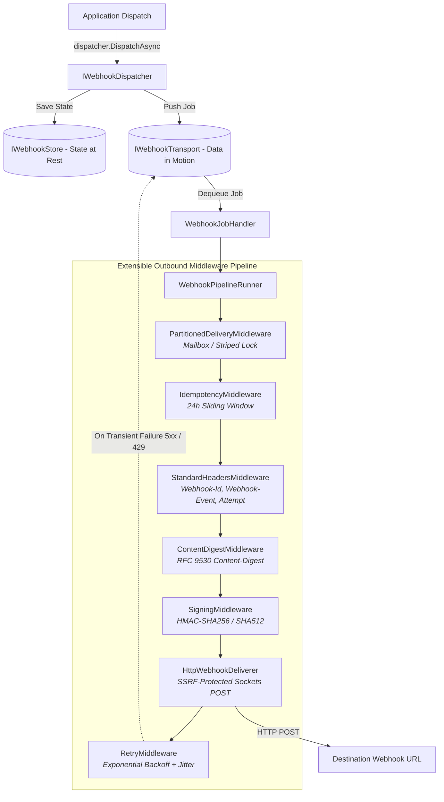

# Wiaoj.Webhooks

[](https://dotnet.microsoft.com/)
[](LICENSE)

The core execution engine, extensible outbound delivery pipeline, cryptographic signers, resilience policies, SSRF hardening, and observability instruments for **Wiaoj.Webhooks**.

---

## 📑 Table of Contents

- [Architectural Overview](#-architectural-overview)
- [Key Features & Modules](#-key-features--modules)
- [Installation & Registration](#-installation--registration)
- [Core Modules Breakdown](#-core-modules-breakdown)
  - [1. Partitioned Concurrency & FIFO Ordering](#1-partitioned-concurrency--fifo-ordering)
  - [2. Cryptographic Signing & Secret Rotation](#2-cryptographic-signing--secret-rotation)
  - [3. Outbound SSRF Hardening & Egress Proxy](#3-outbound-ssrf-hardening--egress-proxy)
  - [4. Standard RFC Metadata & Content Digest](#4-standard-rfc-metadata--content-digest)
  - [5. Resilient Retries & HTTP Status Classifier](#5-resilient-retries--http-status-classifier)
  - [6. Stale In-Flight Job Recovery](#6-stale-in-flight-job-recovery)
  - [7. Outbound Idempotency](#7-outbound-idempotency)
- [OpenTelemetry Tracing & Metrics](#-opentelemetry-tracing--metrics)
- [Ecosystem Packages](#-ecosystem-packages)

---

## 🏛 Architectural Overview



---

## ⚡ Key Features & Modules

- **Extensible Middleware Pipeline:** ASP.NET Core-like outbound pipeline (`IWebhookMiddleware`) allowing custom cross-cutting steps (PII masking, audit logging, custom authentication).
- **Partitioned Concurrency (Strict FIFO):** Dynamic reference-counted mailbox locks (`EndpointMailboxDeliveryLock`) and power-of-two striped locks (`StripedWebhookDeliveryLock`) guarantee serialized delivery per partition key without cross-blocking other tenants.
- **Enterprise SSRF Protection:** Defends against Server-Side Request Forgery (`WebhookIpFilter`) by inspecting resolved IP addresses at the TCP socket layer (blocking RFC 1918 private ranges, loopback, cloud metadata `169.254.169.254`, and encapsulated 6to4, NAT64, and Teredo tunneling attacks).
- **Cryptographic Security:** Constant-time `HmacSha256WebhookSigner` and `HmacSha512WebhookSigner` supporting multi-signature header verification, replay attack prevention, and at-rest encryption via `Wiaoj.Security`.
- **RFC 9530 & CNCF Metadata:** Computes SIMD-accelerated payload digests (`Content-Digest: xxh128=...`, `sha-256=:...:`) and standard diagnostic headers (`Webhook-Id`, `Webhook-Event`, `Webhook-Attempt`, `User-Agent`).
- **Resilient Retry Policies:** Exponential, linear, and fixed backoff policies with full jitter desynchronization and transport-level delayed re-queuing.
- **Self-Healing Stale Job Recovery:** Background worker (`StaleJobRecoveryService`) sweeping and re-enqueuing abandoned in-flight deliveries caused by node crashes or OOM kills using distributed lease locking.
- **Zero-Reflection Replay Engine:** `dispatcher.ReplayAsync(jobId)` re-enqueues dead-lettered jobs using pre-serialized raw payloads with zero CLR type coupling.

---

## 🚀 Installation & Registration

```csharp
using Microsoft.Extensions.DependencyInjection;
using Wiaoj.Webhooks;
using Wiaoj.Webhooks.Retries;

var builder = WebApplication.CreateBuilder(args);

// Register Core Webhooks Engine
builder.Services.AddWiaojWebhooks(webhooks =>
{
    webhooks.UseInMemoryStore()
            .UsePartitionedDelivery()
            .UseStandardHeaders()
            .UseContentDigest(ContentDigestAlgorithm.XxHash128)
            .UseIdempotency(TimeSpan.FromHours(24))
            .UseHmacSha256Signing()
            .UseExponentialBackoffRetry(new ExponentialBackoffOptions
            {
                MaxAttempts = 5,
                InitialDelay = TimeSpan.FromSeconds(2),
                Multiplier = 2.0,
                Jitter = Wiaoj.Extensions.Jitter.Medium
            })
            .UseStaleJobRecovery(options =>
            {
                options.PollingInterval = TimeSpan.FromSeconds(30);
                options.RecoveryLeaseDuration = TimeSpan.FromMinutes(2);
            });
});
```

---

## ⚙️ Core Modules Breakdown

### 1. Partitioned Concurrency & FIFO Ordering
Guarantees that deliveries for the same endpoint (or custom domain partition key such as `OrderId`) execute strictly in FIFO sequence:

```csharp
// 1. Dynamic Zero-Collision Mailbox Lock (Default - Recommended)
webhooks.UsePartitionedDelivery();

// 2. Custom Domain Partition Key Selector (e.g., Order-level FIFO)
webhooks.UsePartitionedDelivery(options =>
{
    options.PartitionKeySelector = ctx => ctx.PartitionKey.Value;
});

// 3. High-Performance Fixed Power-of-Two Striped Lock
webhooks.UseStripedPartitionedDelivery(stripeCount: 4096);
```

### 2. Cryptographic Signing & Secret Rotation
Computes canonical `t={timestamp},v1={hash}` signature headers with unmanaged memory keys (`Secret<byte>`) or at-rest encrypted secrets:

```csharp
// Sender Pipeline:
webhooks.UseHmacSha256Signing(); // or .UseHmacSha512Signing()

// Receiver Verification:
bool isValid = signer.Verify(
    payloadBytes: rawPayload,
    signatureHeader: headers["Webhook-Signature"],
    secretKey: unmanagedSecret,
    tolerance: TimeSpan.FromMinutes(5),
    currentTimestamp: UnixTimestamp.Now);
```

### 3. Outbound SSRF Hardening & Egress Proxy
Protects internal infrastructure from malicious webhook destinations:

```csharp
webhooks.ConfigureSecurity(options =>
{
    options.AllowPrivateNetworks = false;            // Strict SSRF defense (Default)
    options.ConnectTimeout = TimeSpan.FromSeconds(5);
    options.RequestTimeout = TimeSpan.FromSeconds(15);
    options.MaxResponseBodyBytes = 8 * 1024;        // 8 KB body audit limit
    options.Proxy = new WebProxy("http://egress-proxy:8080"); // Optional forward proxy
});

// Proactively validate endpoints at construction time:
WebhookEndpoint endpoint = await new WebhookEndpointBuilder()
    .WithId("ep_customer_1")
    .WithTargetUrl("https://api.customer.com/webhooks")
    .WithSecret("whsec_secure_key_12345", secretProtector)
    .WithSsrfValidation(validate: true)
    .BuildAsync();
```

### 4. Standard RFC Metadata & Content Digest
Injects RFC 9530 integrity hashes and standard metadata:

```csharp
webhooks.UseStandardHeaders(options =>
{
    options.CustomUserAgent = "Acme-Webhooks/1.0";
    options.IncludeWebhookAttempt = true;
});

webhooks.UseContentDigest(ContentDigestAlgorithm.XxHash128); // "Content-Digest: xxh128=..."
```

### 5. Resilient Retries & HTTP Status Classifier
Classifies responses into transient (`5xx`, `429`, `408`, socket drops) vs permanent (`400`, `401`, `403`, `404`) failures:

```csharp
webhooks.UseExponentialBackoffRetry(new ExponentialBackoffOptions
{
    MaxAttempts = 5,
    InitialDelay = TimeSpan.FromSeconds(2),
    Multiplier = 2.0,
    MaxDelay = TimeSpan.FromMinutes(10)
});
```

### 6. Stale In-Flight Job Recovery
Recovers jobs abandoned by worker crashes or OOM kills using distributed lease locking:

```csharp
webhooks.UseStaleJobRecovery(options =>
{
    options.PollingInterval = TimeSpan.FromSeconds(30);
    options.BatchSize = 100;
    options.RecoveryLeaseDuration = TimeSpan.FromMinutes(2);
});
```

### 7. Outbound Idempotency
Prevents duplicate event transmissions within a sliding window:

```csharp
webhooks.UseIdempotency(TimeSpan.FromHours(24));
```

---

## 📊 OpenTelemetry Tracing & Metrics

The core engine emits comprehensive telemetry:

- **ActivitySource:** `Wiaoj.Webhooks`
  - Spans: `webhook.dispatch`, `webhook.deliver`, `webhook.http.post`
  - Tags: `webhook.endpoint_id`, `webhook.partition_key`, `webhook.status_code`, `webhook.success`
- **Meter Instruments:** `Wiaoj.Webhooks`
  - `wiaoj.webhooks.dispatch.count` (Counter)
  - `wiaoj.webhooks.delivery.attempt.count` (Counter)
  - `wiaoj.webhooks.delivery.success.count` (Counter)
  - `wiaoj.webhooks.delivery.failure.count` (Counter)
  - `wiaoj.webhooks.delivery.duration` (Histogram in ms)
  - `wiaoj.webhooks.retry.count` (Counter)
  - `wiaoj.webhooks.dead_letter.count` (Counter)

---

## 📦 Ecosystem Packages

| Package | Description | Reference Link |
|---|---|---|
| **`Wiaoj.Webhooks.Abstractions`** | Core contracts, value objects (`WebhookPartitionKey`, `WebhookEndpointId`, `IdempotencyKey`), and contexts. | [README](../Wiaoj.Webhooks.Abstractions/README.md) |
| **`Wiaoj.Webhooks.AspNetCore`** | Inbound webhook receiver engine, DoS stream protection, policy routing, and Minimal API integration. | [README](../Wiaoj.Webhooks.AspNetCore/README.md) |
| **`Wiaoj.Webhooks.Transports.InMemory`** | In-memory channel transport and `ShardedWebhookTransport` partition router. | [README](../Wiaoj.Webhooks.Transports.InMemory/README.md) |
| **`Wiaoj.Webhooks.BloomFilter`** | O(1) duplicate webhook suppression plugin backed by `Wiaoj.BloomFilter`. | [README](../Wiaoj.Webhooks.BloomFilter/README.md) |
| **`Wiaoj.Webhooks.DistributedCounter`** | Distributed rate limiting middleware plugin backed by `Wiaoj.DistributedCounter`. | [README](../Wiaoj.Webhooks.DistributedCounter/README.md) |

---

## 📄 License

This package is part of the **Wiaoj.Webhooks** ecosystem and is licensed under the [MIT License](../../LICENSE).