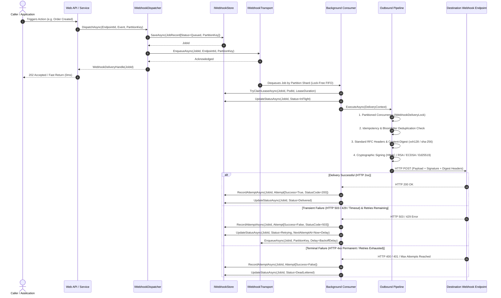

# Wiaoj.Webhooks — End-to-End Architecture & Lifecycle

This document provides a formal, technical breakdown of the end-to-end webhook delivery lifecycle within the **Wiaoj.Webhooks** ecosystem, detailing the decoupled separation between the **State Persistence Layer (`IWebhookStore`)** and the **Execution Transport Layer (`IWebhookTransport`)**, as well as end-to-end **Partition Key Ordering** and **Inbound Ingress**.

---

## 1. Architectural Model & Core Separation

The engine strictly decouples data persistence and state tracking from high-throughput background execution buffering:

- **`IWebhookStore` (Data & State at Rest):** Persists webhook job entities (`WebhookJobRecord`), partition routing keys, historical delivery attempts, payloads, and per-attempt diagnostics (`Queued`, `InFlight`, `Delivered`, `Retrying`, `DeadLettered`).
- **`IWebhookTransport` (Data in Motion):** Provides non-blocking asynchronous execution buffering, partition-sharded routing (`ShardedWebhookTransport`), and delayed scheduling to dispatch jobs to worker pools.



---

## 2. Detailed Lifecycle Stages

### Stage 1: Ingress and Fast Dispatch
1. The application invokes `IWebhookDispatcher.DispatchAsync(endpointId, event, partitionKey)`.
2. The dispatcher generates an immutable, time-ordered `WebhookJobId` (UUIDv7), instantiates a `WebhookJobRecord` with state `Queued` and associated `WebhookPartitionKey`, and persists it to `IWebhookStore.SaveAsync`.
3. The lightweight execution signal is placed onto `IWebhookTransport.EnqueueAsync(job)` (routing to dedicated shard channels via deterministic `XxHash3`).
4. A `WebhookDeliveryHandle(JobId)` is immediately returned to the caller, allowing web requests to complete in sub-millisecond timeframes.

### Stage 2: Background Worker Execution
1. The `InMemoryWebhookConsumer` (or distributed broker consumer) dequeues the job signal from its assigned transport shard.
2. The worker acquires an execution lease lock via `IWebhookStore.TryClaimLeaseAsync` and updates the job status to `InFlight`.
3. The destination endpoint configuration and signing keys are resolved via `IWebhookEndpointResolver`.
4. The execution context is passed through the extensible outbound middleware pipeline:
   - **Partitioned Concurrency Middleware:** Obtains a scoped lock from `IWebhookDeliveryLock` (`EndpointMailboxDeliveryLock` or `StripedWebhookDeliveryLock`) to enforce strict FIFO execution per partition key.
   - **Idempotency & Deduplication Middleware:** Verifies duplicate status via `IIdempotencyStore` or `Wiaoj.Webhooks.BloomFilter`, short-circuiting duplicates with zero network I/O.
   - **Standard Headers & Content-Digest Middleware:** Injects standard RFC 9530 `Content-Digest` and metadata headers (`Webhook-Id`, `Webhook-Event`, `Webhook-Attempt`, `User-Agent`).
   - **Cryptographic Signing Middleware:** Computes cryptographic signatures using symmetric HMAC-SHA256/512 or asymmetric RSA (PS256/RS256), ECDSA (ES256/384/512), or Ed25519.
   - **HTTP Delivery Terminal (`HttpWebhookDeliverer`):** Performs TCP socket-level SSRF validation (`WebhookIpFilter`) and POSTs the request.

### Stage 3: Outcome Classification, Retries & Self-Healing
- **Success Outcome:** If destination returns an acceptable HTTP status code (200, 201, 202, 204), a successful `WebhookDeliveryAttempt` record is appended, and status transitions to `Delivered`.
- **Transient Failure Outcome:** If transient errors occur (HTTP 503, 429, socket timeouts) and retry budget remains, `IWebhookRetryPolicy` calculates jittered backoff. The job transitions to `Retrying` and is re-enqueued with delay while preserving its `WebhookPartitionKey`.
- **Terminal Failure Outcome:** If permanent client errors occur (HTTP 400, 401, 403, 404) or retries are exhausted, the job immediately transitions to `DeadLettered` without wasting retry budgets.
- **Stale Job Recovery:** If a worker node crashes or gets OOM-killed, `StaleJobRecoveryService` sweeps expired in-flight leases and safely re-enqueues abandoned jobs back into the transport.

---

## 3. Querying and Historical Audit API

State tracking in `IWebhookStore` allows external dashboards and administrative APIs to query delivery history without impacting execution queues:

```csharp
// Retrieve real-time delivery status for a specific job
WebhookJobRecord? job = await store.GetJobAsync(jobId, cancellationToken);
// Status: Delivered | Retrying | DeadLettered

// Retrieve complete delivery attempt history and diagnostic logs
IReadOnlyList<WebhookJobRecord> history = await store.GetHistoryByEndpointAsync(endpointId, cancellationToken);
foreach (WebhookDeliveryAttempt attempt in history[0].Attempts)
{
    // Access AttemptNumber, Timestamp, Duration, StatusCode, and Error details
}

// Manually trigger zero-reflection replay for dead-lettered jobs
await dispatcher.ReplayAsync(jobId, cancellationToken);
```