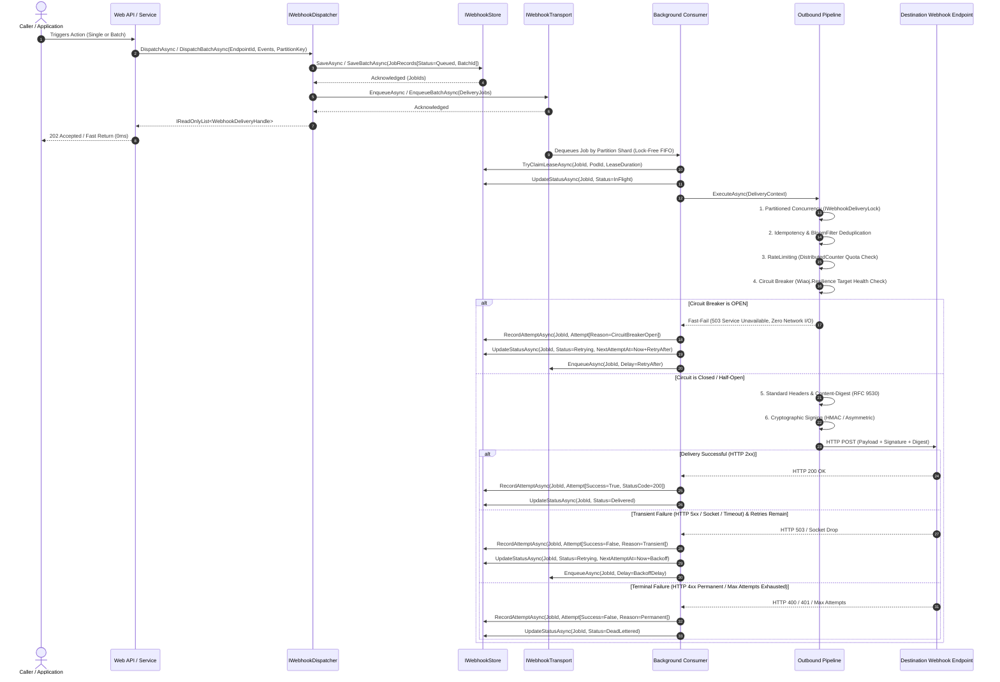

# Wiaoj.Webhooks — End-to-End Architecture & Lifecycle

This document provides a formal, technical breakdown of the end-to-end webhook delivery and receiving lifecycle within the **Wiaoj.Webhooks** ecosystem, detailing the decoupled separation between the **State Persistence Layer (`IWebhookStore`)**, the **Execution Transport Layer (`IWebhookTransport`)**, **Circuit Breaker Resilience (`Wiaoj.Resilience`)**, **Atomic Batching**, **Inbound Payload Unwrapping**, and **1-to-N Publishing Fan-Out**.

---

## 1. Architectural Model & Core Separation

The engine strictly decouples data persistence and state tracking from high-throughput background execution buffering:

- **`IWebhookStore` (Data & State at Rest):** Persists webhook job entities (`WebhookJobRecord`), batch groupings (`BatchId`), partition routing keys, historical delivery attempts, payloads, and per-attempt diagnostics (`Queued`, `InFlight`, `Delivered`, `Retrying`, `DeadLettered`).
- **`IWebhookTransport` (Data in Motion):** Provides non-blocking asynchronous execution buffering, partition-sharded routing (`ShardedWebhookTransport`), delayed retry scheduling, and atomic batch queuing (`EnqueueBatchAsync`) to worker pools.



---

## 2. Detailed Lifecycle Stages

### Stage 1: Ingress and Fast Dispatch (Single & Batch)
1. **Single Dispatch:** The application invokes `IWebhookDispatcher.DispatchAsync(endpointId, event, partitionKey)`.
2. **Atomic Batch Dispatch:** The application invokes `IWebhookDispatcher.DispatchBatchAsync(endpointId, events, partitionKeySelector)`.
3. The dispatcher generates immutable, time-ordered `WebhookJobId`s (UUIDv7), attaches a unified `WebhookBatchId`, instantiates `WebhookJobRecord`s with state `Queued`, and commits them in a **single atomic database operation** via `IWebhookStore.SaveBatchAsync`.
4. Execution work items are enqueued onto `IWebhookTransport.EnqueueBatchAsync(jobs)` (distributed to dedicated shard channels via deterministic `XxHash3`).
5. A list of `WebhookDeliveryHandle`s is returned to the caller in sub-millisecond timeframe without blocking on network transmissions.

### Stage 2: Background Worker Execution & Pipeline
1. The background consumer dequeues the job signal from its assigned transport shard.
2. The worker acquires an execution lease lock via `IWebhookStore.TryClaimLeaseAsync` and transitions status to `InFlight`.
3. Target endpoint configurations (URL, secret, custom signer, static headers) are resolved via `IWebhookEndpointResolver`.
4. The execution context passes through the outbound middleware pipeline:
   - **Partitioned Concurrency Middleware:** Serializes executions sharing the same partition key (`EndpointMailboxDeliveryLock` or `StripedWebhookDeliveryLock`) to guarantee strict FIFO sequence.
   - **Idempotency & Deduplication Middleware:** Suppresses duplicate transmissions within sliding windows via `IIdempotencyStore` or `Wiaoj.Webhooks.BloomFilter`.
   - **Rate Limiting Middleware:** Enforces per-endpoint quota throttling backed by `Wiaoj.RateLimiting`.
   - **Circuit Breaker Middleware:** Evaluates target health via `Wiaoj.Resilience`. If the target is tripped (`Open`), it fast-fails immediately (0 network I/O) and re-enqueues the job. If in `Half-Open`, it permits a single trial probe request.
   - **Standard Headers & Content-Digest Middleware:** Injects RFC 9530 `Content-Digest` and metadata headers (`Webhook-Id`, `Webhook-Event`, `Webhook-Attempt`, `User-Agent`).
   - **Cryptographic Signing Middleware:** Computes cryptographic signatures using symmetric HMAC-SHA256/512 or asymmetric RSA / ECDSA / Ed25519.
   - **HTTP Delivery Terminal (`HttpWebhookDeliverer`):** Performs TCP socket-level SSRF validation (`WebhookIpFilter`) and POSTs the request.

### Stage 3: Outcome Classification, Retries & Self-Healing
- **Success Outcome:** If the target returns HTTP 2xx, a successful `WebhookDeliveryAttempt` is recorded, the circuit breaker resets (`OnSuccessAsync`), and status transitions to `Delivered`.
- **Transient Failure Outcome:** If transient errors occur (HTTP 5xx, socket drops, timeouts) and retry budget remains, `IWebhookRetryPolicy` calculates jittered backoff. The job transitions to `Retrying`, the circuit breaker records failure (`OnFailureAsync`), and the job is re-enqueued with delay preserving its `WebhookPartitionKey`.
- **Terminal Failure Outcome:** If permanent client errors occur (HTTP 400, 401, 403, 404) or retries are exhausted, the job immediately transitions to `DeadLettered` without tripping circuit breakers or wasting retry budgets.
- **Stale Job Recovery:** If a node crashes or gets OOM-killed, `StaleJobRecoveryService` sweeps expired in-flight leases and stranded queued jobs, safely re-enqueuing them back into the transport.

---

## 3. Inbound Ingress & Subtree Unwrapping

Incoming third-party webhooks (e.g. Stripe, GitHub, Shopify) are processed through an ASP.NET Core Minimal API ingress hub:

1. **DoS Bounded Stream Reading:** Reads request body up to `MaxRequestBodyBytes` (default 64 KB) using pooled `AsyncValueBuffer<byte>` memory buffers.
2. **Cryptographic Verification:** Validates signatures in constant-time against unmanaged secrets (`Secret<byte>`) within clock skew tolerance windows (default 5 minutes).
3. **Discriminator Extraction:** Extracts event names from headers (`X-GitHub-Event`) or root JSON properties (`"type"`) without intermediate string allocations.
4. **JSON Subtree Unwrapping (`PayloadPath`):** When configured with a path like `"data.object"`, `Utf8JsonPayloadNavigator` extracts the nested JSON subtree directly from UTF-8 bytes and deserializes directly into target DTO contracts.
5. **Inbound Idempotency:** Intercepts duplicate delivery IDs or payload hashes (`XxHash128`) before invoking business logic.

---

## 4. 1-to-N Publishing & Content-Based Fan-Out

The gateway fan-out broker broadcasts single domain events to multiple subscribers across logical tenant namespaces:

1. **Namespace Isolation:** Events published to `WebhookNamespace("tenant-a")` strictly match subscribers registered under that specific namespace, preventing cross-tenant data leaks.
2. **Topic Pattern Matching:** `WildcardTopicMatcher` evaluates wildcard topic patterns (`*`, `order.*`, `*.created`).
3. **Content-Based Filter Expressions:** `CompositeSubscriptionMatcher` evaluates subscriber filter rules (e.g. `Amount >= 1000 && Currency == 'USD'`) against domain payloads using pre-tokenized AST evaluation.
4. **Crash-Resilient Batch Tracking:** Fan-out progress is tracked via `WebhookPublishBatchRecord`. If an instance terminates mid-dispatch, `StaleBatchRecoveryService` resumes fan-out strictly for unreached subscribers.

---

## 5. Querying and Historical Audit API

State tracking in `IWebhookStore` allows external dashboards and administrative APIs to query delivery history without impacting execution queues:

```csharp
// Retrieve real-time delivery status for a specific job
WebhookJobRecord? job = await store.GetJobAsync(jobId, cancellationToken);
// Status: Delivered | Retrying | DeadLettered

// Retrieve complete delivery attempt history and diagnostic logs
IReadOnlyList<WebhookJobRecord> history = await store.GetHistoryByEndpointAsync(endpointId, cancellationToken);
foreach (WebhookDeliveryAttempt attempt in history[0].Attempts)
{
    // Access AttemptNumber, Timestamp, Duration, Reason, StatusCode, and Error details
}

// Manually trigger zero-reflection replay for dead-lettered jobs
await dispatcher.ReplayAsync(jobId, cancellationToken);
```