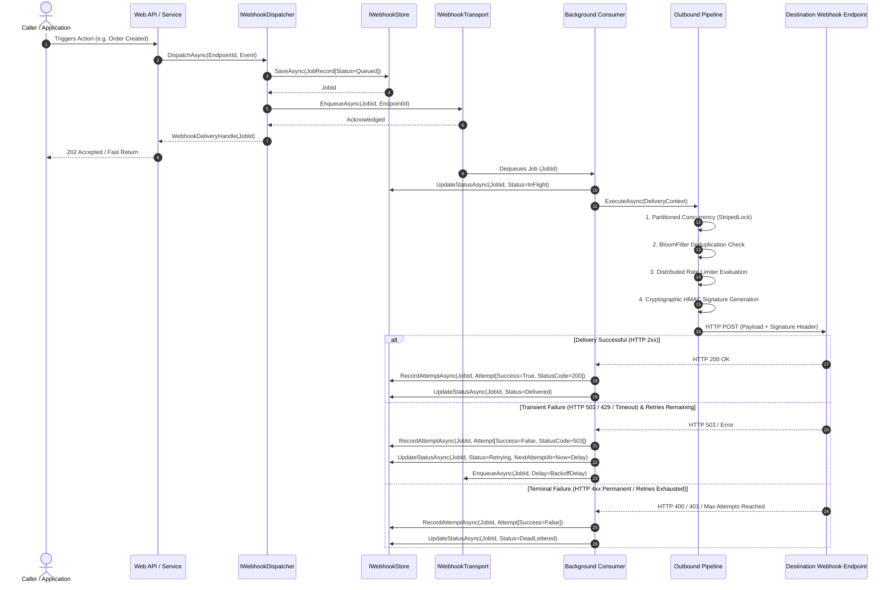

# Wiaoj.Webhooks — End-to-End Architecture & Lifecycle

This document provides a formal, technical breakdown of the end-to-end webhook delivery lifecycle within the **Wiaoj.Webhooks** ecosystem, detailing the decoupled separation between the **State Persistence Layer (`IWebhookStore`)** and the **Execution Transport Layer (`IWebhookTransport`)**.

---

## 1. Architectural Model & Core Separation

The engine separates data persistence and state tracking from background execution buffering:

- **`IWebhookStore` (Data & State at Rest):** Persists webhook job entities, historical execution records, payloads, timestamps, and per-attempt delivery diagnostics (`Queued`, `InFlight`, `Delivered`, `Retrying`, `DeadLettered`).
- **`IWebhookTransport` (Data in Motion):** Provides high-throughput, non-blocking asynchronous execution buffering and delayed scheduling (e.g., in-process channels or distributed message brokers) to dispatch jobs to worker pools.



---

## 2. Detailed Lifecycle Stages

### Stage 1: Ingress and Fast Dispatch
1. The application invokes `IWebhookDispatcher.DispatchAsync(endpointId, event)`.
2. The dispatcher generates an immutable `JobId`, instantiates a `WebhookJobRecord` with initial state `Queued`, and commits it to `IWebhookStore.SaveAsync`.
3. The lightweight execution signal (`JobId` and `EndpointId`) is placed onto `IWebhookTransport.EnqueueAsync`.
4. A `WebhookDeliveryHandle(JobId)` is immediately returned to the caller, allowing web requests to complete in sub-millisecond timeframes without awaiting downstream HTTP latency.

### Stage 2: Background Worker Execution
1. The `BackgroundConsumer` dequeues the job signal from `IWebhookTransport`.
2. The job state is updated to `InFlight` in the store.
3. The destination endpoint configuration and secret keys are resolved via `IWebhookEndpointResolver`.
4. The execution context is passed through the extensible outbound middleware pipeline:
   - **Partitioned Concurrency Middleware:** Obtains a scoped lock from `StripedLock<WebhookEndpointId>` to preserve FIFO message ordering for the specific endpoint while executing different endpoints in parallel.
   - **Bloom Filter Deduplication Middleware:** Verifies whether the event has already been delivered, short-circuiting duplicate executions with zero database overhead.
   - **Distributed Rate Limiting Middleware:** Checks current sliding window consumption against `IDistributedCounterFactory`. If the quota is exceeded, the job is deferred and rescheduled onto the transport with a backpressure delay.
   - **Cryptographic Signing Middleware:** Computes HMAC signatures using canonical `t={timestamp},v1={hash}` formatting and attaches the authentication headers.
   - **HTTP Delivery Terminal:** Dispatches the HTTP POST request to the remote endpoint.

### Stage 3: Outcome Classification and Persistence
- **Success Outcome:** If the destination responds with an acceptable HTTP status code (200, 201, 202, 204), a successful `WebhookDeliveryAttempt` record is appended, and the job status is set to `Delivered`.
- **Transient Failure Outcome:** If a transient error occurs (e.g., HTTP 503, 429, socket timeouts) and remaining retry attempts exist, the configured `IWebhookRetryPolicy` (e.g., Exponential Backoff with full jitter) calculates the next delay. The failed attempt is appended to the store, the status is set to `Retrying`, and the job is re-enqueued onto the transport with the calculated delay.
- **Terminal Failure Outcome:** If non-recoverable error status codes occur (e.g., 400 Bad Request, 401 Unauthorized) or the maximum retry limit is reached, the job is marked as `DeadLettered` for operational inspection and auditing.

---

## 3. Querying and Historical Audit API

Because state tracking is isolated in `IWebhookStore`, external administrative interfaces, APIs, and dashboards can inspect execution states without placing load on the active execution queue:

```csharp
// Retrieve real-time delivery status for a specific job
WebhookJobRecord? job = await store.GetJobAsync(jobId, cancellationToken);
// Status: Delivered | Retrying | DeadLettered

// Retrieve complete delivery attempt history and diagnostic logs
IReadOnlyList<WebhookJobRecord> history = await store.GetHistoryByEndpointAsync(endpointId, cancellationToken);
foreach (WebhookDeliveryAttempt attempt in history[0].Attempts)
{
    // Access AttemptNumber, Timestamp, Duration, StatusCode, and Error details
}
```
